# Map UI Enhancement Plan for RoamMate

## Current State Analysis

The map component ([`frontend/components/map/GoogleMap.tsx`](frontend/components/map/GoogleMap.tsx)) currently:
- Renders numbered `AdvancedMarkerElement` pins (indigo for events, gray for ideas)
- Draws a single polyline route after manual "Refresh Route" click
- Has a day badge, stale-route indicator, and toast notifications
- Uses `disableDefaultUI: true` with only zoom controls
- Has **zero interactivity on markers** -- no click, no hover, no info windows
- Polyline is a basic indigo stroke with no leg annotations
- No visual connection between clicking a timeline card and its map marker

The planner layout ([`frontend/app/trips/page.tsx`](frontend/app/trips/page.tsx), lines 514-517) places the map as a plain `flex-1` div between the Timeline (left) and Idea Bin (right).

## Recommended Enhancements (prioritized by impact)

### Enhancement 1: Marker Info Windows on Click

**Impact: HIGH** -- Currently the map is a "look-only" surface. Adding info windows turns it into an interactive planning tool.

- On marker click, open a Google Maps `InfoWindow` (or custom HTML overlay) showing:
  - **Event title** (bold)
  - **Time badge** (e.g., "10:00 AM -- 12:00 PM" or "TBD")
  - **Category chip** (using `categoryAccent()` from existing code)
  - **Photo thumbnail** (from `event.photo_url`, already available)
  - **Rating** star badge (from `event.rating`)
  - **Address** (from `event.address`)
- Use `AdvancedMarkerElement.addEventListener('goog-click')` or wrap with a click listener
- Style the InfoWindow content with the same design tokens as Timeline cards for visual consistency
- Close other open info windows when a new one opens (singleton pattern)

**Files:** [`GoogleMap.tsx`](frontend/components/map/GoogleMap.tsx) -- add click listeners in the marker creation loop (lines 256-296)

### Enhancement 2: Timeline-Map Bidirectional Highlight

**Impact: HIGH** -- Users should be able to hover or click a timeline card and see the corresponding marker "pulse" on the map, and vice versa.

- Add a `hoveredEventId` / `selectedEventId` to the Zustand store (`lib/store.ts`)
- **Timeline -> Map:** When hovering a timeline card, set `hoveredEventId`; the map effect reads it and applies a bounce animation or scale-up + glow to the matching marker (using `PinElement` with a larger `scale` and different `background`)
- **Map -> Timeline:** When clicking a marker, set `selectedEventId`; Timeline scrolls the matching card into view with `scrollIntoView({ behavior: 'smooth', block: 'center' })`
- Visual: highlighted marker gets a pulsing ring animation (CSS `@keyframes pulse`)

**Files:** [`lib/store.ts`](frontend/lib/store.ts), [`GoogleMap.tsx`](frontend/components/map/GoogleMap.tsx), [`Timeline.tsx`](frontend/components/trip/Timeline.tsx)

### Enhancement 3: Richer Polyline Route Display

**Impact: MEDIUM** -- The current route is a flat indigo line. Improving it communicates travel time between stops.

- **Animated dashed line:** Use `strokeOpacity` + `icons` property on the Polyline to create an animated directional flow (moving dashes or arrows showing travel direction)
- **Leg duration labels:** At the midpoint of each route leg, render a small overlay or custom marker showing "12 min drive" / "5 min walk" (data already available from `RouteLeg.duration_s` and `distance_m`)
- **Color-coded segments:** Each leg gets a slightly different shade or alternating colors so users can distinguish separate legs
- **Polyline entrance animation:** When a new route is computed, animate the polyline drawing in progressively (left to right through waypoints) rather than appearing instantly

**Files:** [`GoogleMap.tsx`](frontend/components/map/GoogleMap.tsx) -- refactor polyline drawing (lines 407-424)

### Enhancement 4: Map Controls and UI Chrome

**Impact: MEDIUM** -- Better map controls improve discoverability and usability.

- **Re-center / fit-bounds button:** A "Fit All" button (compass icon) that resets the map viewport to fit all markers. Currently this only happens on marker refresh, not on demand.
- **Map style toggle:** A subtle toggle between default, satellite, and a muted/light map style (Google Maps `mapId` or `styles` array). Road Trip Planner products benefit from satellite view near destinations.
- **Fullscreen toggle:** Allow the map to expand to fill the viewport temporarily (useful on smaller screens or when the user wants to explore)
- **Legend overlay:** A small collapsible legend in the bottom-left showing what indigo pins (planned events), gray pins (ideas), and the route line represent

**Files:** [`GoogleMap.tsx`](frontend/components/map/GoogleMap.tsx)

### Enhancement 5: Category-Colored Markers

**Impact: MEDIUM** -- Currently all event markers are the same indigo. Using category-based colors makes the map scannable at a glance.

- Reuse `categoryAccent()` from [`lib/categoryColors.ts`](frontend/lib/categoryColors.ts) to derive pin colors per event
- Map each category (Food, Museum, Outdoor, etc.) to a distinct `PinElement.background` color
- Keep the numbered glyph for order, but the background color now communicates category
- Idea markers remain gray to differentiate unscheduled items

**Files:** [`GoogleMap.tsx`](frontend/components/map/GoogleMap.tsx) lines 258-264 (PinElement creation)

### Enhancement 6: Improved Empty and Loading States

**Impact: LOW-MEDIUM** -- Follows UI/UX Pro Max guideline on skeleton screens and empty states.

- **Map loading state:** While the Google Maps JS SDK loads, show a skeleton map placeholder (a subtle gray rectangle with a shimmer animation and a centered map icon) instead of nothing
- **Empty state improvement:** When no markers exist for the day, overlay a styled card on the map saying "No locations yet -- add events with addresses to see them here" with an illustration
- **Route loading skeleton:** While "Refresh Route" is processing, show a pulsing dotted line between markers as a placeholder

**Files:** [`GoogleMap.tsx`](frontend/components/map/GoogleMap.tsx) lines 207-231 (map init), line 467 (mock fallback)

### Enhancement 7: Marker Clustering for Dense Days

**Impact: LOW** -- Only relevant when a day has many events in a small geographic area.

- Use Google Maps `MarkerClusterer` library to group nearby markers when zoomed out
- Show cluster count badge with the event count
- On click, zoom into the cluster to reveal individual markers

**Files:** [`GoogleMap.tsx`](frontend/components/map/GoogleMap.tsx), add `@googlemaps/markerclusterer` dependency

## UI/UX Pro Max Checklist Items to Address

Based on the skill's Quick Reference and Road Trip Planner product type recommendations:

- **touch-target-size:** Ensure map control buttons (Refresh Route, Fit All) meet 44x44px minimum
- **loading-states:** Skeleton screen for map init (currently blank div)
- **color-not-only:** Numbered glyphs on markers already help; adding category labels in info windows adds redundancy
- **press-feedback:** Refresh Route button should have active/pressed state feedback (currently only has hover)
- **cursor-pointer:** Ensure all interactive map overlays have `cursor: pointer`
- **reduced-motion:** Respect `prefers-reduced-motion` for polyline animation and marker bounce
- **state-transition:** Marker highlight changes should animate smoothly (150-300ms)

## Implementation Priority

```mermaid
graph TD
  E1["1. Marker Info Windows"] --> E2["2. Timeline-Map Highlight"]
  E2 --> E3["3. Richer Route Display"]
  E3 --> E4["4. Map Controls"]
  E1 --> E5["5. Category-Colored Markers"]
  E4 --> E6["6. Loading/Empty States"]
  E6 --> E7["7. Marker Clustering"]
```

Enhancements 1 and 5 are independent and can be done in parallel. Enhancement 2 depends on 1 (click handler infrastructure). Enhancement 3 builds on the existing route rendering. Enhancements 6 and 7 are lower priority polish items.
