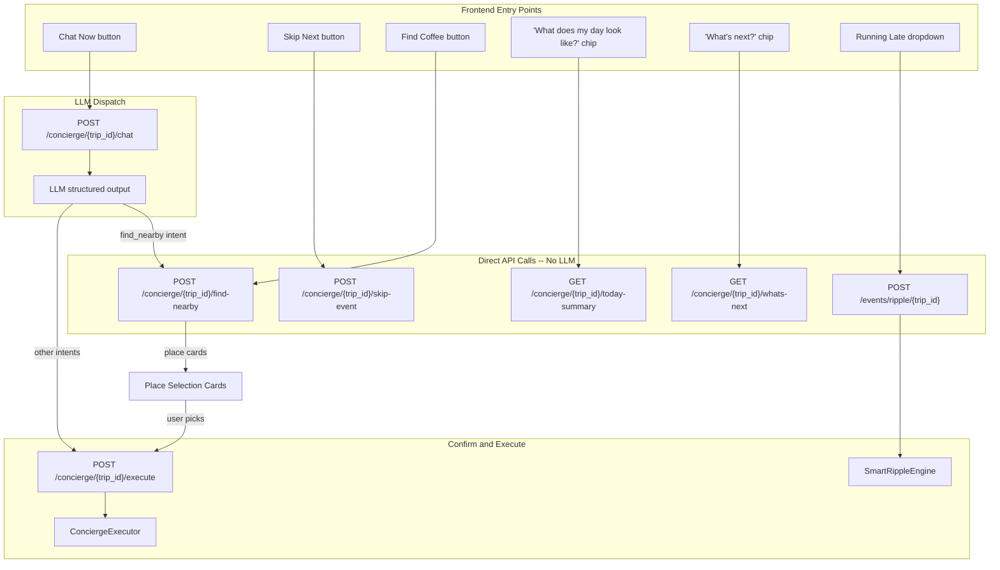
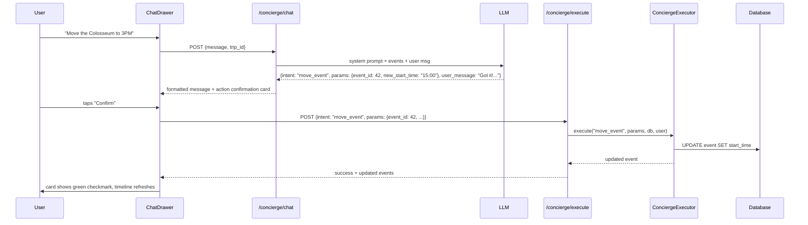
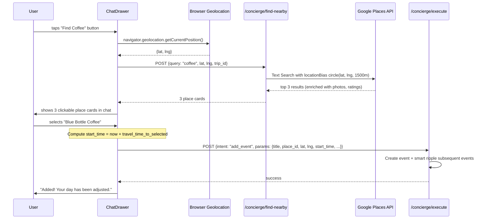
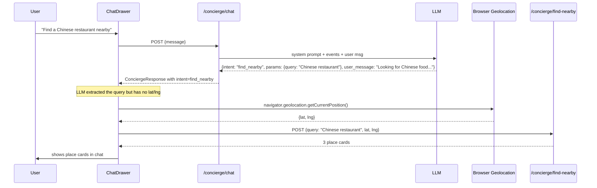

# Concierge Intent Dispatcher (v2)

## Design Principles

1. **Hybrid Chat** -- Not every interaction needs an LLM call. "What's next?", "Skip Next", and "Find Coffee" use direct API calls. Only free-text and ambiguous requests go through the LLM dispatcher.
2. **Confirm-Before-Execute** -- LLM proposes, user confirms, backend executes using the params from the original response. No second LLM call on confirm. If the user modifies via chat, a new LLM call fetches updated params.
3. **Formatted Responses** -- All chat messages (LLM or API-driven) are rendered with proper formatting: bold headings, bullet lists, place cards, action cards. Never raw text dumps.
4. **Witty Error Recovery** -- On LLM parse failure, show a playful error message with a retry button, not raw fallback data.
5. **Smart Ripple** -- The "Running Late" button uses travel-time-aware logic: only shift events that actually need it, based on actual Directions API travel durations between consecutive events.

## Architecture Overview



## Confirm-Execute Flow (for LLM intents)



## Find Coffee Flow (No LLM -- Direct API)



---

## Layer 1: Data Model Changes

### 1a. ConciergeMessage Model

**File:** [backend/app/models/all_models.py](backend/app/models/all_models.py)

New model mirroring `BrainstormMessage`, private per-user:

- `id`, `trip_id`, `user_id`, `role` ("user" | "assistant" | "system"), `content` (str), `message_type` ("text" | "action_card" | "place_card" | "error"), `metadata` (JSON -- stores intent, params, confirmation status), `created_at`

### 1b. Soft-Skip Flag on Event

**File:** [backend/app/models/all_models.py](backend/app/models/all_models.py)

Add `is_skipped: bool = False` column to the `Event` model. Skipped events stay on the timeline but are greyed out and excluded from route computation. No gap-closing; the free time is left for the user.

Update [backend/app/schemas/event.py](backend/app/schemas/event.py) to include `is_skipped` in `Event`, `EventCreate`, and `EventUpdate`.

Update [backend/app/api/endpoints/maps.py](backend/app/api/endpoints/maps.py) route computation to filter out `is_skipped == True` events before building waypoints.

---

## Layer 2: Backend Schemas

**File:** New `backend/app/schemas/concierge.py`

```python
class ConciergeIntent(str, Enum):
    shift_timeline = "shift_timeline"
    move_event = "move_event"
    add_event = "add_event"
    skip_event = "skip_event"       # soft-skip (is_skipped = True)
    explain_plan = "explain_plan"
    find_nearby = "find_nearby"
    chat_only = "chat_only"

class ConciergeResponse(BaseModel):
    intent: ConciergeIntent
    user_message: str       # formatted explanation (supports **bold**, bullet lists)
    params: dict            # intent-specific (validated at execute time)
    requires_confirmation: bool = True
```

Per-intent param shapes:
- `shift_timeline`: `{delta_minutes: int, start_from_event_id?: int}`
- `move_event`: `{event_id: int, new_start_time?: str, new_day_date?: str}`
- `add_event`: `{title: str, day_date?: str, start_time?: str, end_time?: str, category?: str, place_id?: str, lat?: float, lng?: float}`
- `skip_event`: `{event_id: int}`
- `explain_plan`: `{scope: "today" | "next" | "full", question?: str}` -- no mutation
- `find_nearby`: `{query: str}` -- lat/lng NOT included (frontend fills from geolocation before calling the nearby API)
- `chat_only`: `{}` -- plain text response

Request/response schemas for the API endpoints:
- `ConciergeChatRequest`: `{message: str}`
- `ConciergeChatResponse`: `{intent, user_message, params, requires_confirmation, message_type}`
- `FindNearbyRequest`: `{query: str, lat: float, lng: float, limit: int = 3}`
- `FindNearbyResponse`: `{places: list[PlaceCard]}` where `PlaceCard` has `{place_id, title, address, lat, lng, rating, price_level, photo_url, travel_time_s?, distance_m?}`
- `SkipEventRequest`: `{event_id: int}`
- `ExecuteRequest`: `{intent: str, params: dict}`
- `ExecuteResponse`: `{success: bool, message: str, updated_events?: list, new_event?: Event}`

---

## Layer 3: Concierge Prompt (Structured Output)

**File:** New `backend/app/services/llm/services/v1/prompts/concierge_dispatch_v1.txt` (keep old concierge_v1.txt for reference)

Key prompt design:

- System prompt injects today's events as a numbered list with: `[id=42] 09:00-10:30 | Colosseum Tour | Culture & Arts | Via dei Fori Imperiali (lat, lng)`
- Includes travel times between consecutive events if available from route legs
- Includes current time so the LLM can reason about "what's next"
- Schema definition embedded in prompt
- Intent decision tree with 2-3 examples per intent
- Personality: concise, friendly, on-the-go tone
- Explicit rule: "You MUST respond with valid JSON matching the schema. No markdown wrapping, no extra text."
- Explicit rule: "Never invent event IDs. Only reference IDs from the events list above."
- Explicit rule: "For explain_plan, set requires_confirmation to false."
- Explicit rule: "For find_nearby, extract the search query from the user's message into params.query. Do NOT include lat or lng -- the app handles location separately."

---

## Layer 4: LLM Service + Client

### 4a. Service Method

**Files:** [backend/app/services/llm/services/base.py](backend/app/services/llm/services/base.py), [backend/app/services/llm/services/v1/roammate_v1.py](backend/app/services/llm/services/v1/roammate_v1.py)

Add abstract `concierge_dispatch()` to `BaseLLMService`, implement in `RoammateServiceV1`:

- Loads `concierge_dispatch_v1.txt`
- Builds enhanced context via `_pack_trip_context_with_ids()` that includes event IDs, times, locations, and inter-event travel durations
- Injects `current_time` into the prompt
- Calls `model.complete(messages, response_schema=ConciergeResponse, temperature=0.3)`
- On JSON parse success: returns the validated `ConciergeResponse`
- **On parse failure**: returns a special error response with `intent="chat_only"`, `user_message` set to a witty/funny message like "Hmm, my travel brain just short-circuited! Could you rephrase that? I promise I'm usually sharper than this.", `params={"retry": true}`. No BANGKOK_FALLBACK_ITEMS, no raw LLM text dump.

### 4b. Client Update

**File:** [backend/app/services/llm/clients/concierge_client.py](backend/app/services/llm/clients/concierge_client.py)

Add `dispatch()` method:
- Accepts `history`, `user_message`, `trip_context` (with events + travel times + current_time), `user_id`
- Delegates to `self._service.concierge_dispatch()`
- Returns `ConciergeResponse` dict

---

## Layer 5: Smart Ripple Engine

**File:** New `backend/app/services/smart_ripple.py`

The current `RippleEngine.shift_itinerary()` blindly shifts ALL events after `start_from_time` by `delta_minutes`. The smart version uses travel times to only shift events that actually need it.

**Algorithm:**

```
Input: trip_id, delta_minutes, start_from_time (or start_from_event_id)
1. Load today's events sorted by start_time ASC
2. Find the "anchor" event (the one the user is running late from)
3. Shift the anchor event's end_time by delta_minutes
4. Walk forward through subsequent events:
   For each consecutive pair (prev, curr):
     a. Compute travel_time from prev.location to curr.location via Directions API
     b. available_gap = curr.start_time - prev.end_time
     c. needed_gap = travel_time (from Directions API)
     d. If available_gap >= needed_gap: STOP -- this event and all after have enough buffer
     e. Else: shift curr by (needed_gap - available_gap) minutes, continue walking
5. Recompute route legs for affected pairs (call Directions API for new travel times)
6. Return list of shifted events + new travel times
```

Key details:
- The Directions API (`_directions_api_call`) takes waypoints by place_id or lat/lng -- it does NOT use event times. Travel time is purely distance-based. So we call it per consecutive pair to get point-to-point travel duration.
- For events without routable locations, assume zero travel time (same as route endpoint behavior).
- Reuse existing `GoogleMapsService.directions()` which has caching + circuit breaker built in. Call with 2-waypoint pairs to get individual leg travel times.

The existing `POST /events/ripple/{trip_id}` endpoint should be updated to use `SmartRippleEngine` instead of the naive `ripple_engine`.

---

## Layer 6: Nearby Search (Google Maps)

**Files:** [backend/app/services/google_maps/base.py](backend/app/services/google_maps/base.py) (abstract), [backend/app/services/google_maps/v1.py](backend/app/services/google_maps/v1.py), [backend/app/services/google_maps/v2.py](backend/app/services/google_maps/v2.py), [backend/app/services/google_maps/mock.py](backend/app/services/google_maps/mock.py), [backend/app/core/config.py](backend/app/core/config.py)

### 6a. New Config Variable

Add to `Settings` in [backend/app/core/config.py](backend/app/core/config.py):

```python
GOOGLE_MAPS_USE_NEARBY_API: bool = False  # True = Nearby Search API, False = Text Search with locationBias
```

When `False` (default): uses Text Search API with `location` / `locationBias` parameter. This is more flexible -- supports natural language queries like "vegan restaurant", "ATM", "petrol pump" etc.

When `True`: uses the dedicated Nearby Search API which works with structured `type=` parameters. More precise for well-known place types but less flexible for free-text queries.

**Recommendation:** Default to `False` (Text Search with location) since the concierge handles arbitrary free-text queries from chat ("find a Chinese restaurant", "ATM nearby", "petrol pump") which the Nearby Search API's rigid `type=` parameter cannot handle as well.

### 6b. Abstract Method

Add to `BaseMapService` in [backend/app/services/google_maps/base.py](backend/app/services/google_maps/base.py):

```python
@abc.abstractmethod
async def nearby_search(
    self, query: str, lat: float, lng: float,
    radius_m: int = 1500, limit: int = 3,
) -> list[dict[str, Any]]:
    """Search for places near a location. Returns enriched place card dicts.

    Implementation switches between Nearby Search API and Text Search API
    based on settings.GOOGLE_MAPS_USE_NEARBY_API.
    """
    ...
```

### 6c. MapServiceV1 Implementation (Legacy APIs)

Two code paths inside `MapServiceV1.nearby_search()`:

**Path A -- Text Search (`GOOGLE_MAPS_USE_NEARBY_API = False`):**
- Endpoint: `https://maps.googleapis.com/maps/api/place/textsearch/json`
- Params: `query=coffee`, `location=lat,lng`, `radius=1500`, `key=...`
- Response shape: `results[]` with `place_id`, `name`, `geometry.location`, `formatted_address`, `types`, `rating`, `price_level`, `photos[]`

**Path B -- Nearby Search (`GOOGLE_MAPS_USE_NEARBY_API = True`):**
- Endpoint: `https://maps.googleapis.com/maps/api/place/nearbysearch/json`
- Params: `location=lat,lng`, `radius=1500`, `keyword=coffee` (or `type=cafe` for known types), `key=...`
- Response shape: same as Text Search (`results[]` with same fields)

Both paths:
- Respect `GOOGLE_MAPS_FETCH_RATING` and `GOOGLE_MAPS_FETCH_PHOTOS` config flags
- Use cache + breaker + tracker (cache key includes query + lat/lng rounded to 3 decimals)
- Return top `limit` results normalized to: `{place_id, title, address, lat, lng, rating, price_level, photo_url, types}`

### 6d. MapServiceV2 Implementation (New APIs)

Two code paths inside `MapServiceV2.nearby_search()`:

**Path A -- Text Search (`GOOGLE_MAPS_USE_NEARBY_API = False`):**
- Endpoint: `https://places.googleapis.com/v1/places:searchText` (already used by `find_place`)
- JSON body: `{textQuery: "coffee", locationBias: {circle: {center: {latitude, longitude}, radius: 1500}}, maxResultCount: 3}`
- Field mask: `places.id,places.displayName,places.formattedAddress,places.location,places.types` + optionally `places.rating,places.priceLevel` (if `GOOGLE_MAPS_FETCH_RATING`) + `places.photos` (if `GOOGLE_MAPS_FETCH_PHOTOS`)
- Headers: `X-Goog-Api-Key`, `X-Goog-FieldMask`

**Path B -- Nearby Search (`GOOGLE_MAPS_USE_NEARBY_API = True`):**
- Endpoint: `https://places.googleapis.com/v1/places:searchNearby`
- JSON body: `{locationRestriction: {circle: {center: {latitude, longitude}, radius: 1500}}, maxResultCount: 3, includedTypes: ["cafe"]}` (or `includedPrimaryTypes` for stricter matching)
- Note: The new Nearby Search API does NOT support free-text `textQuery` -- it only works with structured `includedTypes`. For arbitrary queries like "Chinese restaurant" or "ATM", this falls back to Text Search automatically.
- Field mask: same as Text Search path

Both paths normalize results to: `{place_id, title, address, lat, lng, rating, price_level, photo_url, types}`

### 6e. MockMapService Implementation

Returns 3 hardcoded places with realistic data (e.g., "Roma Cafe", "Espresso Bar Trastevere", "Caffe Sant'Eustachio") regardless of config flag. Each includes mock lat/lng near the input coordinates, a mock photo_url, rating 4.2-4.7, price_level 1-2.

### 6f. LLM-to-FindNearby Handoff (Chat-based nearby requests)

When a user types "find a Chinese restaurant nearby" or "where's the nearest ATM?" in the chat, the flow is:



Key design decisions:
- The LLM's job is ONLY to classify the intent as `find_nearby` and extract the `query` string from natural language. It does NOT know the user's location and does NOT resolve places.
- The `find_nearby` params from the LLM contain `query` but NO `lat`/`lng`. The frontend fills those in from browser geolocation before calling the nearby API.
- The prompt explicitly instructs the LLM: "For find_nearby intent, extract the search query from the user's message. Do NOT include lat/lng -- the app will handle location."
- The frontend detects `intent == "find_nearby"` in the LLM response, automatically triggers geolocation, and calls the nearby API -- making this seamless for the user.
- If geolocation is denied, show the friendly location-access message with a retry button (same as the button-triggered flow).

---

## Layer 7: Intent Executor

**File:** New `backend/app/services/concierge_executor.py`

```python
class ConciergeExecutor:
    async def execute(self, intent: str, params: dict, db, trip_id, user) -> dict:
        match intent:
            case "skip_event":    return await self._skip(params, db, trip_id, user)
            case "shift_timeline": return await self._shift(params, db, trip_id, user)
            case "move_event":    return await self._move(params, db, trip_id, user)
            case "add_event":     return await self._add(params, db, trip_id, user)
            case "find_nearby":   return await self._add_nearby(params, db, trip_id, user)
```

Per-intent logic:
- **skip_event**: Set `event.is_skipped = True`, commit. Return updated event. No gap closing.
- **shift_timeline**: Delegate to `SmartRippleEngine`. Return list of shifted events + new travel times.
- **move_event**: Update event's `start_time`/`end_time`/`day_date`. Commit. Return updated event.
- **add_event**: Create new `Event` row (reuse field logic from `events.py:create_event`). If the event is being inserted mid-day, run smart ripple on subsequent events. Return new event.
- **add_nearby** (from FindNearby selection): Create event from the selected place card data. Compute start_time = current_time + travel_time_to_place (via Directions API). Run smart ripple on subsequent events. Return new event + shifted events.

---

## Layer 8: API Endpoints

**File:** New `backend/app/api/endpoints/concierge.py`, register in [backend/app/api/router.py](backend/app/api/router.py) as `router.include_router(concierge.router, prefix="/concierge", tags=["concierge"])`

### Endpoints:

**1. `POST /concierge/{trip_id}/chat`** -- LLM dispatch (for free-text and ambiguous requests)
- Auth: `get_current_user` + `require_trip_member`
- Input: `ConciergeChatRequest {message: str}`
- Loads today's events with IDs, travel times from cached route legs, current server time
- Loads concierge message history for this user+trip
- Calls `ConciergeChatClient.dispatch()`
- Persists user message + assistant response as `ConciergeMessage` rows (private per-user)
- Returns: `ConciergeChatResponse {intent, user_message, params, requires_confirmation, message_type}`

**2. `POST /concierge/{trip_id}/execute`** -- confirm and execute (no LLM)
- Input: `ExecuteRequest {intent: str, params: dict}`
- Calls `ConciergeExecutor.execute()`
- Persists a system message like "Action confirmed: Skipped Colosseum Tour" as `ConciergeMessage`
- Returns: `ExecuteResponse {success, message, updated_events, new_event}`

**3. `POST /concierge/{trip_id}/find-nearby`** -- no LLM, direct Google Maps
- Input: `FindNearbyRequest {query: str, lat: float, lng: float, limit: int = 3}`
- Calls `GoogleMapsService.nearby_search(query, lat, lng, limit=3)`
- For each result, compute travel_time from user's location via Directions API (2 waypoints: user_pos -> place)
- Returns: `FindNearbyResponse {places: list[PlaceCard]}` with travel_time_s and distance_m per place

**4. `POST /concierge/{trip_id}/skip-event`** -- no LLM, direct skip
- Input: `SkipEventRequest {event_id: int}`
- Sets `event.is_skipped = True`, commits
- Persists a system message in ConciergeMessage
- Returns: updated event

**5. `GET /concierge/{trip_id}/whats-next`** -- no LLM, pure data query
- Finds the next event after `current_time` (not skipped)
- Returns: `{current_event?: Event, next_event?: Event, time_until_next?: str, travel_time_to_next?: int}`

**6. `GET /concierge/{trip_id}/today-summary`** -- no LLM, pure data query
- Returns all of today's events with their status (upcoming/ongoing/completed/skipped), formatted as a structured summary
- Returns: `{date, total_events, completed, upcoming, skipped, events: list[{event, status}]}`

---

## Layer 9: Frontend -- Chat Drawer

**File:** New `frontend/components/trip/ConciergeChatDrawer.tsx`

### Layout
- Right-side slide-in panel (420px desktop, full-width mobile bottom sheet)
- Header: "Concierge" title + close (X) button
- Scrollable message area
- Intent chips bar above input
- Input field + send button at bottom

### Message Types (rendered differently)

**a. User Messages** -- right-aligned, indigo bubble, plain text

**b. Assistant Text Messages** -- left-aligned, white/slate bubble, **formatted rendering**:
- Support `**bold**` and `*italic*` inline
- Bullet lists rendered as proper HTML lists
- Event references rendered as inline chips with the event title
- Time references rendered with clock icon

**c. Action Confirmation Cards** -- left-aligned, bordered card with:
- Intent icon (clock for shift, skip-forward for skip, plus for add, map-pin for move)
- Title describing the action: "Skip Colosseum Tour"
- Params summary as bullet points
- Two buttons: "Confirm" (indigo) + "Nevermind" (grey text)
- After confirm: collapses to green checkmark + "Done -- [action description]"
- After nevermind: collapses to grey "Cancelled"
- After confirm, frontend calls `POST /execute`, then `useTripStore.loadEvents()` to refresh timeline

**d. Place Selection Cards** (for FindNearby) -- left-aligned, horizontal scroll of 3 cards:
- Each card: photo thumbnail (if available), title, rating stars, price level dots, address, travel time badge ("12 min drive")
- Tapping a card selects it, shows a confirmation: "Add Blue Bottle Coffee at 2:15 PM?"
- On confirm, calls `POST /execute` with `add_event` intent + place data + computed start_time

**e. Error / Retry Card** -- left-aligned, amber-bordered card:
- Witty message (from backend `user_message` field)
- "Try Again" button that re-shows the input field focused
- No raw JSON, no fallback data

**f. Summary Cards** (for "What's next?" / "Today summary") -- left-aligned, clean card:
- Rendered from the direct API response (no LLM)
- Shows event list with status badges (ongoing/upcoming/completed/skipped)
- "What's next?" shows the current + next event with time-until

### Intent Chips

Small pill buttons above the input, horizontally scrollable:
1. **"What does my day look like?"** -- calls `GET /today-summary`, renders summary card. No LLM.
2. **"What's next?"** -- calls `GET /whats-next`, renders next-event card. No LLM.
3. **"Find Coffee"** -- triggers geolocation, calls `POST /find-nearby`, renders place cards. No LLM.

No "Push back 15 min" chip. The "Running Late" dropdown on the action bar handles this.

### Geolocation Handling

For "Find Coffee" (chip or action bar button):
1. Call `navigator.geolocation.getCurrentPosition()`
2. On success: send lat/lng to `POST /find-nearby`
3. On error/denied: show a friendly message: "I need your location to find places nearby. Please enable location access." with a "Retry" button

---

## Layer 10: Frontend -- Action Bar Wiring

**File:** [frontend/components/trip/ConciergeActionBar.tsx](frontend/components/trip/ConciergeActionBar.tsx)

### "Running Late" (already wired, needs smart ripple upgrade)
- Keep the existing dropdown (15/30/60 min)
- Change the `POST /events/ripple/{trip_id}` call -- backend now uses `SmartRippleEngine`
- On success, show a brief toast or message in the chat drawer: "Shifted 2 events. Museum pushed to 3:30 PM, Dinner stays at 7 PM (enough buffer)."

### "Skip Next" (line 98-103)
- `onClick`: Find the next upcoming event (from store, after current time, not skipped)
- Open chat drawer
- Show an action confirmation card directly (no LLM call): "Skip [Event Title]?"
- On confirm: call `POST /concierge/{trip_id}/skip-event` with `event_id`
- On success: refresh events, show green checkmark

### "Find Coffee" (line 105-110)
- `onClick`: Request browser geolocation
- Open chat drawer
- Show "Finding coffee near you..." loading state
- Call `POST /concierge/{trip_id}/find-nearby` with `{query: "coffee", lat, lng}`
- Render 3 place cards in the chat
- On card selection: compute start_time, show confirmation card, execute on confirm

### "Chat Now" (line 114-117)
- `onClick`: Open chat drawer in empty state, input field focused
- No pre-composed message, user types freely

### Communication between ActionBar and Drawer
- Lift drawer state up to a shared context/store (e.g., add `conciergeDrawerOpen`, `conciergePreMessage`, `conciergePendingAction` to `useTripStore` or a new lightweight context)

---

## Layer 11: Smart Ripple Integration with Running Late

When "Running Late" fires:

1. Frontend calls `POST /events/ripple/{trip_id}` with `{delta_minutes, start_from_time}`
2. Backend `SmartRippleEngine` algorithm:
   - Load today's events sorted by start_time
   - Identify the event the user is currently at (or just finished)
   - Shift that event's end_time forward by `delta_minutes`
   - Walk forward, computing actual travel times via Directions API:
     - `travel_time = directions(prev.location, curr.location).duration_s / 60`
     - `available_buffer = curr.start_time - (prev.end_time + travel_time_minutes)`
     - If `available_buffer >= 0`: STOP, no shift needed for this event or beyond
     - If `available_buffer < 0`: shift `curr` forward by `abs(available_buffer)` minutes, continue
3. Return shifted events to frontend
4. Frontend updates store + shows summary in chat drawer

**Important**: The Directions API computes travel time based on locations (place_id or lat/lng), NOT based on event times. We call it with 2-point pairs: `[prev_event_location, next_event_location]` to get the driving duration between them. The event's end_time is used only in our buffer calculation, not sent to Google.

---

## Key Files Summary

### New Files
- `backend/app/schemas/concierge.py` -- all Pydantic models
- `backend/app/services/concierge_executor.py` -- intent dispatcher
- `backend/app/services/smart_ripple.py` -- travel-time-aware ripple
- `backend/app/api/endpoints/concierge.py` -- 6 API endpoints
- `backend/app/services/llm/services/v1/prompts/concierge_dispatch_v1.txt` -- LLM prompt
- `frontend/components/trip/ConciergeChatDrawer.tsx` -- chat UI

### Modified Files
- `backend/app/models/all_models.py` -- add `ConciergeMessage` model + `is_skipped` on Event
- `backend/app/schemas/event.py` -- add `is_skipped` field
- `backend/app/services/llm/services/base.py` -- add abstract `concierge_dispatch()`
- `backend/app/services/llm/services/v1/roammate_v1.py` -- implement `concierge_dispatch()`
- `backend/app/services/llm/clients/concierge_client.py` -- add `dispatch()` method
- `backend/app/core/config.py` -- add `GOOGLE_MAPS_USE_NEARBY_API` setting
- `backend/app/services/google_maps/base.py` -- add abstract `nearby_search()`
- `backend/app/services/google_maps/v1.py` -- implement `nearby_search()` with legacy Text Search / Nearby Search
- `backend/app/services/google_maps/v2.py` -- implement `nearby_search()` with new Text Search / Nearby Search
- `backend/app/services/google_maps/mock.py` -- mock `nearby_search()`
- `backend/app/api/router.py` -- register concierge router
- `backend/app/api/endpoints/maps.py` -- filter out `is_skipped` events from route
- `backend/app/api/endpoints/events.py` -- update ripple endpoint to use SmartRippleEngine
- `frontend/components/trip/ConciergeActionBar.tsx` -- wire all 3 buttons
- `frontend/lib/store.ts` -- add concierge drawer state (or new context)

---

## Future Scope

### 1. VibeCheck Wiring

Wire [frontend/components/trip/VibeCheck.tsx](frontend/components/trip/VibeCheck.tsx) `handleVibeSelect` (currently a `console.log` mock at line 21-34) to open the chat drawer and send an energy-level-based message through the LLM dispatch:
- "low" -> "I'm feeling low energy today. Suggest relaxing alternatives for any strenuous activities."
- "medium" -> "I'm feeling steady energy. Keep the plan as-is but let me know if anything looks too packed."
- "high" -> "I'm feeling very active today! Any adventure activities I could add?"

The LLM would respond with `explain_plan` or `chat_only` intent containing itinerary-aware suggestions. This requires an LLM call since it needs reasoning about the specific activities on the timeline.

### 2. Smart Ripple -- Batch Directions API Optimization

Currently the Smart Ripple Engine calls the Directions API **per consecutive event pair** to get point-to-point travel durations (e.g., event A -> event B, then event B -> event C, etc.). For a day with N events, this means up to N-1 individual Directions API calls during a single ripple operation.

**Optimization**: Batch all affected events into a single multi-waypoint Directions call. The existing `directions()` method already supports multi-waypoint routes and returns per-leg durations. Instead of calling `directions([A, B])` then `directions([B, C])` then `directions([C, D])`, call `directions([A, B, C, D])` once and read individual `legs[i].duration_s` values. This would:
- Reduce N-1 API calls to 1 call
- Reduce latency proportionally (each call is ~100-300ms with network)
- Reduce Google Maps API cost (one route computation vs. N-1)
- Leverage the existing cache/breaker/tracker infrastructure unchanged

**Tradeoff**: The single-call approach computes all legs upfront, but the smart ripple algorithm may STOP early (when buffer is sufficient). With per-pair calls, we avoid computing travel times for legs we never need. The optimization is most valuable when many events need shifting (worst case), and wasteful when only 1-2 events are affected (common case). A hybrid approach could batch the first ~3 pairs speculatively and extend if needed.
