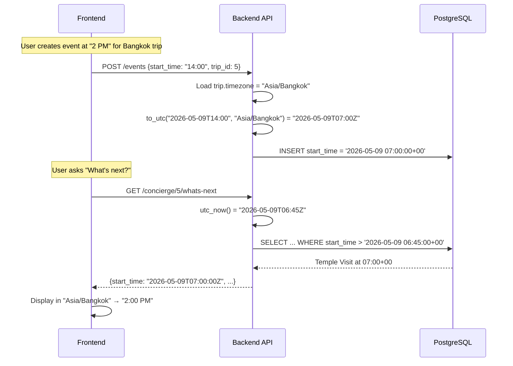

# Fix Timezone Handling Across DB, Backend, and Frontend

## The Problem

The app currently has a fragile, inconsistent timezone model that has caused repeated bugs. Datetimes are handled differently depending on who wrote the code and when, creating a patchwork of hacks.

## Current State Audit

### 1. Database: Mixed column types

The DB has **two different column types** for datetimes:

- **`TIMESTAMP WITHOUT TIME ZONE`** (naive) — used for `Event.start_time`, `Event.end_time`, `Trip.start_date`, `Trip.end_date`, `User.created_at`
- **`TIMESTAMP WITH TIME ZONE`** (tz-aware) — used for `Group.created_at`, `TripMember.created_at`, `Notification.created_at`, `Notification.read_at`, `TokenUsage.created_at`, `GoogleMapsApiUsage.created_at`, `BrainstormBinItem.created_at`, `ConciergeMessage.created_at`

This means some timestamps are stored as UTC-aware, others as ambiguous naive datetimes. PostgreSQL's `func.now()` returns UTC in the `TIMESTAMP WITH TIME ZONE` columns but server-local time in `TIMESTAMP WITHOUT TIME ZONE` columns.

### 2. Backend: Mixed `datetime.now()` vs `datetime.utcnow()`

- [concierge.py](backend/app/api/endpoints/concierge.py), [dashboard.py](backend/app/api/endpoints/dashboard.py), [smart_ripple.py](backend/app/services/smart_ripple.py), [concierge_executor.py](backend/app/services/concierge_executor.py) — all use **`datetime.now()`** (server-local time, which happens to be UTC in Docker, but would break if deployed to a non-UTC server)
- [security.py](backend/app/core/security.py), [admin.py](backend/app/api/endpoints/admin.py) — use **`datetime.utcnow()`** (deprecated in Python 3.12+)
- [all_models.py](backend/app/models/all_models.py) — some models use `default=datetime.utcnow` (Python-side), others use `server_default=func.now()` (DB-side)

### 3. The `_strip_tz` Hack (appears in 3 separate places)

Because the DB uses `TIMESTAMP WITHOUT TIME ZONE` for events but the frontend sometimes sends `Z`-suffixed strings, there are **three separate `_strip_tz` implementations**:

- [event.py schema](backend/app/schemas/event.py) lines 8-20 — converts to UTC then strips tzinfo
- [concierge_executor.py](backend/app/services/concierge_executor.py) lines 19-22 — just strips tzinfo (no UTC conversion!)
- [concierge.py endpoint](backend/app/api/endpoints/concierge.py) lines 57-58 — strips tzinfo after replacing "Z"
- [dashboard.py endpoint](backend/app/api/endpoints/dashboard.py) lines 83-84 — same pattern

These implementations are **inconsistent**: the event schema converts to UTC before stripping, but the concierge executor just strips blindly.

### 4. The `client_now` Hack

Because the server doesn't know the user's local time, three endpoints accept a `client_now` query parameter where the frontend manually formats its local time and sends it:

- `/api/dashboard/today`
- `/api/concierge/{trip_id}/whats-next`
- `/api/concierge/{trip_id}/today-summary`
- `/api/concierge/{trip_id}/chat`

The frontend has **three duplicated `localISO()` helper functions** that manually format `Date` components to avoid UTC conversion:

- [ConciergeChatDrawer.tsx](frontend/components/trip/ConciergeChatDrawer.tsx) line 15
- [ConciergeActionBar.tsx](frontend/components/trip/ConciergeActionBar.tsx) line 26
- [TodayWidget.tsx](frontend/components/dashboard/TodayWidget.tsx) line 68
- [store.ts](frontend/lib/store.ts) line 12 (`toLocalISOString`)

### 5. The Frontend: Naive local assumption

The frontend stores event times as JavaScript `Date` objects and uses `toLocalISOString()` (a custom helper) to send them to the backend. This means the datetime stored in the DB represents the user's **browser timezone at the time of creation**, but there is no record of what that timezone was.

### 6. Trip has no timezone, User timezone is unused

- `User.timezone` exists (e.g., "Asia/Bangkok") but is **never used** by any backend logic
- `Trip` has **no timezone field** at all
- The backend has no way to know what timezone an event's `start_time` refers to

## Why This Is Broken

Consider a Bangalore-based user (UTC+5:30) planning a Bangkok trip (UTC+7):

1. User creates an event "Temple Visit" at 2:00 PM Bangkok time
2. Frontend sends `"2026-05-09T14:00:00"` (their intended local time)
3. DB stores `2026-05-09 14:00:00` (naive — is this Bangkok? Bangalore? UTC?)
4. Later, the "What's Next" endpoint runs `datetime.now()` on the server (UTC) and compares it to `14:00:00` — wrong timezone entirely
5. The `client_now` hack patches this by having the frontend send its local time, but the frontend is in Bangalore (UTC+5:30), not Bangkok (UTC+7)

The fundamental issue: **nobody knows what timezone the stored datetime refers to**.

## Proposed Solution: Trip-Timezone-Aware UTC Storage

### Core Principle

> **Store everything as UTC in the database. Convert at the API boundary using the trip's destination timezone.**

```
Frontend (display) ←→ API boundary (convert) ←→ DB (always UTC)
    Bangkok 2pm          tz="Asia/Bangkok"        07:00 UTC
```

### Design Decisions

- **All datetime columns** become `TIMESTAMP WITH TIME ZONE` — PostgreSQL stores them as UTC internally
- **Trip gets a `timezone` field** (IANA string, e.g., `"Asia/Bangkok"`) — this is the trip's destination timezone, set at creation (editable)
- **The backend always works in UTC** — `datetime.now(timezone.utc)` everywhere
- **The API returns UTC strings** with `Z` suffix (e.g., `"2026-05-09T07:00:00Z"`)
- **The frontend converts for display** using the trip's timezone (via `Intl.DateTimeFormat` or a lightweight library)
- **Event creation**: frontend sends the wall-clock time + the trip's timezone; backend converts to UTC before storing
- **"What's next" / "today"**: backend uses `datetime.now(UTC)` and compares against UTC-stored times — no `client_now` hack needed
- **`client_now` parameter**: eliminated entirely

### Changes

#### Layer 1: Database (fresh start)

- All `DateTime` columns → `DateTime(timezone=True)` in [all_models.py](backend/app/models/all_models.py)
- Add `timezone = Column(String, default="UTC")` to the `Trip` model
- All `default=datetime.utcnow` → `server_default=func.now()` (let Postgres handle it; `func.now()` in `TIMESTAMPTZ` columns always stores UTC)

#### Layer 2: Backend — Schemas

- Remove all `_strip_tz` functions from [event.py](backend/app/schemas/event.py), [concierge_executor.py](backend/app/services/concierge_executor.py), [concierge.py](backend/app/api/endpoints/concierge.py), [dashboard.py](backend/app/api/endpoints/dashboard.py)
- Add a shared utility module `backend/app/utils/timezone.py`:
  - `utc_now()` — returns `datetime.now(timezone.utc)`
  - `to_utc(dt_naive, tz_name)` — interprets a naive datetime as being in `tz_name` and converts to UTC
  - `from_utc(dt_utc, tz_name)` — converts a UTC datetime to the given timezone (for display, if needed server-side like LLM prompts)
  - `today_in_tz(tz_name)` — returns `date.today()` in the given timezone
- Event schema validators: instead of stripping tz, ensure datetimes are tz-aware (UTC). If naive, treat as trip-timezone and convert to UTC
- Remove `client_now` from `ConciergeChatRequest`, dashboard endpoint, concierge endpoints

#### Layer 3: Backend — Endpoints and Services

- All `datetime.now()` → `utc_now()` from the shared utility
- All `datetime.utcnow()` → `utc_now()` (Python 3.12 deprecation)
- All `date.today()` → `today_in_tz(trip.timezone)` (look up the trip's timezone)
- Dashboard "today" endpoint: determine "today" by looking at the user's active trip timezone (or user's profile timezone as fallback)
- Concierge endpoints: load the trip's timezone from DB, use it for "today" / "what's next" comparisons
- Smart Ripple Engine: compare UTC times — no timezone issues since everything is UTC
- Concierge Executor: receive naive wall-clock times from params, convert using trip timezone before storing

#### Layer 4: Backend — LLM Prompts

- When building context for the LLM (event list, current time), convert UTC times to the trip's timezone for human-readable display
- The LLM returns wall-clock times (e.g., "14:00") which the backend interprets in the trip's timezone and converts to UTC

#### Layer 5: Frontend

- Remove all `localISO()` / `toLocalISOString()` helpers
- Send datetimes as UTC (`new Date().toISOString()`) or as naive wall-clock + trip timezone
- For event creation/editing: send the wall-clock time the user selected (which is in the trip's timezone) as a naive string, plus include `trip_timezone` so the backend can convert
- For display: convert UTC times from the API to the trip's timezone using `Intl.DateTimeFormat`:
  ```typescript
  const fmt = new Intl.DateTimeFormat('en-US', {
    timeZone: trip.timezone, // "Asia/Bangkok"
    hour: 'numeric', minute: '2-digit',
  });
  fmt.format(new Date(event.start_time)); // "2:00 PM"
  ```
- Remove `client_now` from all fetch calls
- Store trip timezone in the Zustand store alongside the trip data

#### Layer 6: Tests

- Update [test_event_schema.py](backend/tests/schemas/test_event_schema.py) — remove `_strip_tz` tests, add UTC conversion tests
- Update [test_ripple_api.py](backend/tests/api/test_ripple_api.py) — send UTC times
- Update [test_dashboard.py](backend/tests/api/test_dashboard.py) — remove `client_now` tests, add trip-timezone tests
- Update [test_concierge.py](backend/tests/api/test_concierge.py) — remove `client_now`, test timezone-aware queries

## Data Flow (After Fix)



## What Gets Eliminated

- All 3 `_strip_tz` functions
- All 4 `localISO()` / `toLocalISOString()` helpers on frontend
- All `client_now` parameters (4 endpoints)
- All `_parse_client_now` helpers
- The inconsistency between `datetime.now()` and `datetime.utcnow()`
- The ambiguity of "what timezone is this datetime in?"
