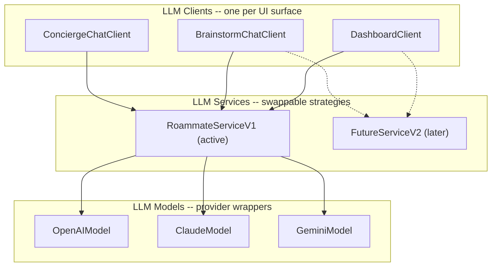
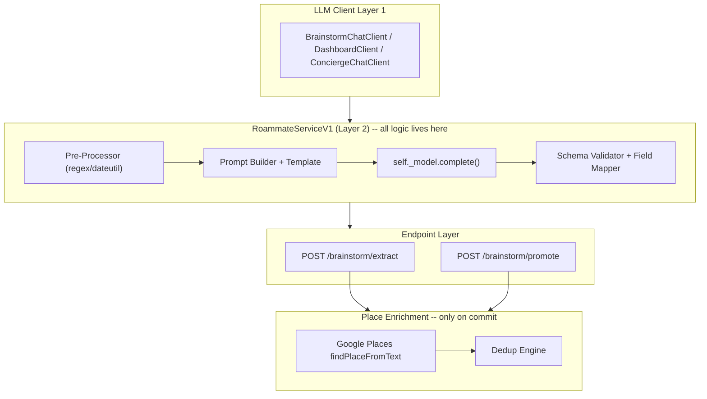

# Phase 1A LLM Integration Strategy for Roammate

## Current State

The codebase has a well-structured scaffolding for LLM integration. Three key stubs exist:

- `**llm_client.py**` -- facade with `chat()`, `extract_items()`, `plan_trip()` that currently return hardcoded Bangkok fallback data when `LLM_ENABLED=False`
- `**nlp_service.py**` -- a thin OpenAI wrapper with a `parse_quick_add()` method (to be replaced)
- `**brainstorm.py` endpoints** -- full CRUD pipeline: chat -> extract -> bulk insert -> promote to Idea Bin, already wired

Three frontend surfaces consume LLM functionality today:

- **DashboardTripPlanner** (`frontend/components/dashboard/DashboardTripPlanner.tsx`) -- calls `POST /api/llm/plan-trip`
- **BrainstormChat** (`frontend/components/trip/BrainstormChat.tsx`) -- calls `POST /api/trips/{id}/brainstorm/chat` and `/extract`
- **ConciergeActionBar** (`frontend/components/trip/ConciergeActionBar.tsx`) -- "Chat Now" button (not yet wired to LLM)

The target output is a `BrainstormBinItem` with ~18 fields (title, description, category, place_id, lat, lng, address, photo_url, rating, price_level, types, opening_hours, phone, website, time_hint, time_category, url_source).

---

## Step 0: Three-Tier Abstraction Layer (BUILD FIRST)

This is the foundational architecture. Everything else depends on it.

### 0.0 Architecture Overview




The three layers have clean, one-directional dependencies:

- **Clients** know about **Services** (but not Models)
- **Services** know about **Models** (but not Clients)
- **Models** know about provider SDKs only

### 0.1 Layer 3 (Bottom): LLM Models -- Provider Wrappers

**File: `backend/app/services/llm/models/base.py`**

```python
from abc import ABC, abstractmethod
from dataclasses import dataclass
from pydantic import BaseModel

@dataclass
class LLMResponse:
    content: str
    raw_response: dict           # full provider response for debugging
    input_tokens: int
    output_tokens: int
    model: str
    provider: str

class BaseLLMModel(ABC):
    """Wrapper around a single LLM provider (OpenAI, Anthropic, Google)."""

    @abstractmethod
    async def complete(
        self,
        messages: list[dict],
        temperature: float = 0.7,
        max_tokens: int = 2000,
        response_schema: type[BaseModel] | None = None,
    ) -> LLMResponse:
        """Send messages to the provider and return a structured response."""
        ...

    @abstractmethod
    def provider_name(self) -> str: ...

    @abstractmethod
    def model_name(self) -> str: ...
```

**File: `backend/app/services/llm/models/openai_model.py`**

```python
class OpenAIModel(BaseLLMModel):
    def __init__(self, api_key: str, model: str = "gpt-4o-mini"):
        self._api_key = api_key
        self._model = model
        self._client: AsyncOpenAI | None = None

    def _get_client(self) -> AsyncOpenAI:
        if self._client is None:
            self._client = AsyncOpenAI(api_key=self._api_key)
        return self._client

    async def complete(self, messages, temperature=0.7, max_tokens=2000, response_schema=None) -> LLMResponse:
        kwargs = { "model": self._model, "messages": messages, "temperature": temperature, "max_tokens": max_tokens }
        if response_schema:
            kwargs["response_format"] = {"type": "json_schema", "json_schema": {"name": "response", "schema": response_schema.model_json_schema()}}
        resp = await self._get_client().chat.completions.create(**kwargs)
        return LLMResponse(
            content=resp.choices[0].message.content,
            raw_response=resp.model_dump(),
            input_tokens=resp.usage.prompt_tokens,
            output_tokens=resp.usage.completion_tokens,
            model=self._model,
            provider="openai",
        )
```

**File: `backend/app/services/llm/models/claude_model.py`**

```python
class ClaudeModel(BaseLLMModel):
    def __init__(self, api_key: str, model: str = "claude-sonnet-4-20250514"):
        ...
    # Uses anthropic SDK; structured output via tool_use pattern
    # Key stored here, injected from Settings
```

**File: `backend/app/services/llm/models/gemini_model.py`**

```python
class GeminiModel(BaseLLMModel):
    def __init__(self, api_key: str, model: str = "gemini-2.0-flash"):
        ...
    # Uses google-genai SDK; structured output via response_schema
```

Each model class:

- Owns its provider SDK client + API key
- Handles provider-specific structured output enforcement
- Returns a unified `LLMResponse` dataclass
- Implements retry with exponential backoff (3 attempts on 429/500/503)

### 0.2 Layer 2 (Middle): LLM Services -- Strategy Pattern

**File: `backend/app/services/llm/services/base.py`**

```python
from abc import ABC, abstractmethod
from app.services.llm.models.base import BaseLLMModel, LLMResponse

class BaseLLMService(ABC):
    """A service strategy that orchestrates pre-processing, LLM call, post-processing."""

    def __init__(self, model: BaseLLMModel):
        self._model = model

    @abstractmethod
    async def chat(self, history: list[dict], user_message: str, context: dict | None = None) -> str:
        """Conversational turn. Returns assistant text."""
        ...

    @abstractmethod
    async def extract_items(self, history: list[dict], context: dict | None = None) -> list[dict]:
        """Extract structured items from a conversation."""
        ...

    @abstractmethod
    async def plan_trip(self, prompt: str, context: dict | None = None) -> dict:
        """Generate a trip plan from a free-form prompt."""
        ...

    @property
    def model(self) -> BaseLLMModel:
        return self._model
```

**File: `backend/app/services/llm/services/roammate_v1.py`**

```python
class RoammateServiceV1(BaseLLMService):
    """First concrete service: pre-process -> LLM call -> post-process."""

    async def chat(self, history, user_message, context=None) -> str:
        # 1. Load prompt template from backend/app/prompts/brainstorm_chat_v1.txt
        # 2. Build messages array with system prompt + trimmed history + user_message
        # 3. Call self._model.complete(messages)
        # 4. Return response.content
        ...

    async def extract_items(self, history, context=None) -> list[dict]:
        # 1. Load prompt template from backend/app/prompts/brainstorm_extract_v1.txt
        # 2. Build messages with schema enforcement (response_schema=LLMExtractResponse)
        # 3. Call self._model.complete(messages, response_schema=...)
        # 4. Parse JSON, run post-processing (place resolution, dedup, field mapping)
        # 5. Return list of BrainstormBinItem-compatible dicts
        ...

    async def plan_trip(self, prompt, context=None) -> dict:
        # 1. Pre-process prompt via NLP extractor (city, dates, budget, vibes)
        # 2. Load prompt template, inject pre-extracted fields
        # 3. Call self._model.complete(messages, response_schema=...)
        # 4. Post-process: place resolution, field mapping
        # 5. Return {trip_name, start_date, duration_days, items}
        ...
```

The `context` dict is an extensibility point where clients pass client-specific state (current trip events for Concierge, existing bin items for dedup, etc.).

A future `RoammateServiceV2` could implement a different strategy (multi-pass, chain-of-thought, agent loop) while keeping the same interface.

### 0.3 Layer 1 (Top): LLM Clients -- Per-Surface Adapters

**File: `backend/app/services/llm/clients/base.py`**

```python
from abc import ABC, abstractmethod
from app.services.llm.services.base import BaseLLMService

class BaseLLMClient(ABC):
    """One per UI surface. Owns context building and delegates to a service."""

    def __init__(self, service: BaseLLMService):
        self._service = service

    @property
    def service(self) -> BaseLLMService:
        return self._service
```

**File: `backend/app/services/llm/clients/dashboard_client.py`**

```python
class DashboardClient(BaseLLMClient):
    """Serves the DashboardTripPlanner -- plan-trip from a single prompt."""

    async def plan_trip(self, prompt: str) -> dict:
        # Build context: nothing extra needed for dashboard
        return await self._service.plan_trip(prompt, context={"source": "dashboard"})
```

**File: `backend/app/services/llm/clients/brainstorm_client.py`**

```python
class BrainstormChatClient(BaseLLMClient):
    """Serves the BrainstormChat panel -- multi-turn chat + extract."""

    async def chat(self, history: list[dict], user_message: str, trip_id: int | None = None) -> str:
        context = {"source": "brainstorm", "trip_id": trip_id}
        return await self._service.chat(history, user_message, context=context)

    async def extract_items(self, history: list[dict], trip_id: int | None = None) -> list[dict]:
        context = {"source": "brainstorm", "trip_id": trip_id}
        return await self._service.extract_items(history, context=context)
```

**File: `backend/app/services/llm/clients/concierge_client.py`**

```python
class ConciergeChatClient(BaseLLMClient):
    """Serves the Chat Now concierge on the live trip page."""

    async def chat(self, history: list[dict], user_message: str, trip_context: dict) -> str:
        # trip_context includes: today's events, user role, trip members, active day
        context = {"source": "concierge", **trip_context}
        return await self._service.chat(history, user_message, context=context)
```

Each client:

- Knows its UI surface and what context to pass
- Delegates all LLM logic to the service
- Is the thing the FastAPI endpoints instantiate and call

### 0.4 Registry / Factory and Config

**File: `backend/app/services/llm/registry.py`**

```python
from app.core.config import settings
from app.services.llm.models.openai_model import OpenAIModel
from app.services.llm.models.claude_model import ClaudeModel
from app.services.llm.models.gemini_model import GeminiModel
from app.services.llm.services.roammate_v1 import RoammateServiceV1
from app.services.llm.clients.dashboard_client import DashboardClient
from app.services.llm.clients.brainstorm_client import BrainstormChatClient
from app.services.llm.clients.concierge_client import ConciergeChatClient

_MODEL_MAP = {
    "openai": OpenAIModel,
    "claude": ClaudeModel,
    "gemini": GeminiModel,
}

_KEY_MAP = {
    "openai": lambda: settings.OPENAI_API_KEY,
    "claude": lambda: settings.ANTHROPIC_API_KEY,
    "gemini": lambda: settings.GEMINI_API_KEY,
}

def _build_model() -> BaseLLMModel:
    provider = settings.LLM_PROVIDER            # "openai" | "claude" | "gemini"
    model_cls = _MODEL_MAP[provider]
    api_key = _KEY_MAP[provider]()
    return model_cls(api_key=api_key, model=settings.LLM_MODEL)

def _build_service() -> BaseLLMService:
    model = _build_model()
    return RoammateServiceV1(model)              # swap to V2 here when ready

def get_dashboard_client() -> DashboardClient:
    return DashboardClient(_build_service())

def get_brainstorm_client() -> BrainstormChatClient:
    return BrainstormChatClient(_build_service())

def get_concierge_client() -> ConciergeChatClient:
    return ConciergeChatClient(_build_service())
```

**Config additions to `backend/app/core/config.py`:**

```python
LLM_PROVIDER: str = "openai"         # "openai" | "claude" | "gemini"
LLM_MODEL: str = "gpt-4o-mini"       # model name within the provider
LLM_MAX_TOKENS: int = 2000
ANTHROPIC_API_KEY: Optional[str] = None
GEMINI_API_KEY: Optional[str] = None
```

Switching providers becomes a one-line `.env` change: `LLM_PROVIDER=claude` + `LLM_MODEL=claude-sonnet-4-20250514`.

### 0.5 File Tree for the Abstraction Layer

```
backend/app/services/llm/
    __init__.py
    registry.py                         # factory functions
    models/
        __init__.py
        base.py                         # BaseLLMModel ABC + LLMResponse
        openai_model.py
        claude_model.py
        gemini_model.py
    services/
        __init__.py
        base.py                         # BaseLLMService ABC
        roammate_v1.py                  # first concrete service
    clients/
        __init__.py
        base.py                         # BaseLLMClient ABC
        dashboard_client.py
        brainstorm_client.py
        concierge_client.py
```

### 0.6 Wiring Into Existing Endpoints

The current [brainstorm.py](backend/app/api/endpoints/brainstorm.py) endpoint calls `llm_client.chat()` and `llm_client.extract_items()` as bare module functions. Replace with:

```python
# In brainstorm.py chat endpoint:
from app.services.llm.registry import get_brainstorm_client

client = get_brainstorm_client()
assistant_content = await client.chat(history, body.message, trip_id=trip_id)
```

The current [llm.py](backend/app/api/endpoints/llm.py) endpoint calls `llm_client.plan_trip()`. Replace with:

```python
# In llm.py plan_trip endpoint:
from app.services.llm.registry import get_dashboard_client

client = get_dashboard_client()
result = await client.plan_trip(body.prompt)
```

The old `backend/app/services/llm_client.py` becomes a thin backward-compat shim that delegates to the registry, then is removed once all callers are migrated.

### 0.7 Fallback Path (LLM_ENABLED=False)

The `RoammateServiceV1` checks `settings.LLM_ENABLED` at the top of each method. When disabled, it returns the existing Bangkok fallback data (moved from the old `llm_client.py` into a `backend/app/services/llm/fallbacks.py` module). This preserves the current test suite behavior -- all ~439+ tests keep passing without an API key.

---

## Architecture: Full Pipeline (Post-Abstraction)

All pre-processing, prompt engineering, structured output enforcement, and field mapping happen inside `RoammateServiceV1` (Layer 2). The LLM Model layer (Layer 3) is transparent -- whichever provider is configured in [registry.py](backend/app/services/llm/registry.py) via `LLM_PROVIDER` / `LLM_MODEL` is used automatically. Google Places enrichment is intentionally deferred to the **extract** and **promote** endpoints (not during chat) to avoid wasted API calls on items the user may never commit to.




---

## Step 1. LLM I/O Schemas (in `backend/app/schemas/llm.py`)

Define slim Pydantic models used by `RoammateServiceV1` for structured output enforcement. These are **not** the full `BrainstormBinItem` -- they contain only the fields the LLM should generate.

```python
from enum import Enum
from pydantic import BaseModel

class Category(str, Enum):
    FOOD = "Food & Dining"
    CULTURE = "Culture & Arts"
    NATURE = "Nature & Outdoors"
    SHOPPING = "Shopping"
    ENTERTAINMENT = "Entertainment"
    SPORTS = "Sports & Adventure"
    RELIGIOUS = "Religious & Spiritual"
    NIGHTLIFE = "Nightlife"
    LANDMARKS = "Landmarks & Viewpoints"
    ACTIVITIES = "Activities & Tours"

class LLMItem(BaseModel):
    t: str                              # title
    d: str = ""                         # description
    cat: Category = Category.ACTIVITIES # category (constrained enum)
    tc: str = "afternoon"               # time_category
    dur: int = 60                       # duration_minutes
    price: int = 0                      # price_level (0-4)
    tags: list[str] = []                # type tags

class LLMExtractResponse(BaseModel):
    items: list[LLMItem]

class LLMPlanResponse(BaseModel):
    trip_name: str
    duration_days: int
    items: list[LLMItem]
```

**Where this is used:** `RoammateServiceV1.extract_items()` and `plan_trip()` pass `response_schema=LLMExtractResponse` (or `LLMPlanResponse`) to `self._model.complete()`. The Model layer handles the provider-specific enforcement:

- OpenAI: `response_format=json_schema`
- Claude: `tool_use` with `input_schema`
- Gemini: `response_schema`

Abbreviated keys (`t`, `d`, `cat`, `tc`) save ~40% output tokens across 10 items vs. full field names.

---

## Step 2. Pre-Processing: Maximize Signal Before the LLM

**File: `backend/app/services/llm/pre_processor.py`**

All logic is zero-LLM: regex, `dateparser`, curated lookup tables. Called by `RoammateServiceV1` at the top of `chat()`, `extract_items()`, and `plan_trip()`.

### What it extracts


| Signal         | Method                                                                                   | Example Input -> Output                              |
| -------------- | ---------------------------------------------------------------------------------------- | ---------------------------------------------------- |
| Dates & Ranges | `dateparser`                                                                             | "March 15-20" -> `{start_date, end_date}`            |
| City / Country | ~5K curated city list + fuzzy match                                                      | "Tokyo" -> `{city: "Tokyo", country: "Japan"}`       |
| Duration       | regex                                                                                    | "3 days", "a week" -> `{num_days: 3}`                |
| Group size     | regex                                                                                    | "4 of us", "couple" -> `{group_size: 4}`             |
| Budget tier    | keyword                                                                                  | "budget", "luxury" -> `{budget_tier: "budget"}`      |
| Vibes / prefs  | keyword classify                                                                         | "food and temples" -> `{vibes: ["food", "culture"]}` |
| Time hints     | regex (reuses `_extract_time_hint` from [idea_bin.py](backend/app/services/idea_bin.py)) | "at 2pm" -> `{time_hints: ["2pm"]}`                  |


### Output: `PreExtracted` dataclass

```python
@dataclass
class PreExtracted:
    raw_text: str
    city: str | None
    country: str | None
    start_date: date | None
    end_date: date | None
    num_days: int | None
    group_size: int | None
    budget_tier: str | None
    vibes: list[str]
    time_hints: list[str]
    explicit_places: list[str]
    residual_text: str              # what remains after stripping extracted tokens
```

### Why this matters for tokens

*"Plan 5 days in Tokyo for 4 people, we love food and temples, mid-range budget, arriving March 15"*

- **Without pre-processing:** LLM parses all of this AND generates items (~800-1200 input tokens)
- **With pre-processing:** LLM receives compact JSON: `{"city":"Tokyo","days":5,"vibes":["food","culture"],"budget":"mid"}` + residual. Saves ~30-40% input tokens.

---

## Step 3. Prompt Engineering: Templates Inside `RoammateServiceV1`

### 3a. System Prompts -- Compact, Role-Based, One-Shot

Stored as versioned template files, loaded by `RoammateServiceV1`:

```
backend/app/prompts/
  brainstorm_chat_v1.txt        # conversational brainstorm
  brainstorm_extract_v1.txt     # structured item extraction
  plan_trip_v1.txt              # full trip plan generation
  concierge_v1.txt              # Chat Now intent dispatch (1A.2)
```

Key principles:

- **Role anchor:** "You are Roammate, a travel concierge."
- **One-shot example** instead of paragraphs: costs ~100 tokens but eliminates re-asks
- **Abbreviated keys** in extract/plan templates: `t`, `d`, `cat`, `tc`, `dur`, `price`, `tags`
- **Pre-extracted context injected** into the template: `{city}`, `{num_days}`, `{budget_tier}`, `{vibes}` are filled by the pre-processor. The LLM never has to parse them.

### 3b. Model Selection -- Handled by Config, Not Code

Model selection is **entirely driven by `LLM_PROVIDER` + `LLM_MODEL`** in [registry.py](backend/app/services/llm/registry.py). There is no per-use-case model switching in V1. The developer sets one provider/model combo in `.env` and all three clients use it. Per-use-case model overrides (e.g. `gpt-4o` for plan-trip, `gpt-4o-mini` for chat) can be added as a V2 feature by extending `BaseLLMService` to accept model hints from context.

### 3c. Prompt Rules by Surface

**Brainstorm Chat** (`brainstorm_chat_v1.txt`):

- Be concise -- 2-3 sentences max per suggestion
- Suggest 5-10 specific real places when a destination is mentioned
- Never invent opening hours, prices, or addresses
- Ask ONE clarifying question if the request is vague

**Extract** (`brainstorm_extract_v1.txt`):

- Extract every concrete place/activity/restaurant from the conversation
- Use abbreviated keys matching `LLMItem` schema
- Deduplicate same place appearing multiple times
- Assign `tc` from: [early morning, morning, midday, afternoon, late afternoon, evening, night, late night]

**Plan Trip** (`plan_trip_v1.txt`):

- Generate `{num_items}` diverse items for `{city}`, `{country}`
- Cover at least 4 different categories
- Respect budget tier `{budget_tier}`
- If `{group_size}` > 2, prefer group-friendly activities

### 3d. Structured Output Enforcement

Handled transparently by the Model layer (Layer 3). `RoammateServiceV1` passes `response_schema=LLMExtractResponse` to `self._model.complete()`, and each provider wrapper enforces it:

- **OpenAI:** `response_format=json_schema` -- guaranteed valid JSON
- **Claude:** `tool_use` with `input_schema` matching the Pydantic model
- **Gemini:** `response_schema` parameter in the generative API

This eliminates retry loops for malformed JSON and removes "please output valid JSON" from prompts (token savings).

---

## Step 4. Wiring the Pipeline into `RoammateServiceV1`

This is the core step: replace the current stub implementations in [roammate_v1.py](backend/app/services/llm/services/roammate_v1.py) with the real pre-process -> prompt -> model -> parse -> map flow.

### `chat()` flow:

1. Pre-process `user_message` -> `PreExtracted` (for context, not consumed by the LLM directly in chat mode)
2. Load `brainstorm_chat_v1.txt` template
3. Trim history to last N=6 messages
4. Build messages: `[system_prompt, ...trimmed_history, user_message]`
5. Call `self._model.complete(messages)`
6. Return `response.content` (plain text reply)

### `extract_items()` flow:

1. Load `brainstorm_extract_v1.txt` template
2. Build messages: `[system_prompt, ...history]`
3. Call `self._model.complete(messages, response_schema=LLMExtractResponse, temperature=0.3)`
4. Parse JSON -> list of `LLMItem`
5. Map each `LLMItem` to `BrainstormBinItem`-compatible dict via `llm_item_to_brainstorm()` (title, description, category, time_category, time_hint, price_level, types -- **no Google Places fields**)
6. Return the list

### `plan_trip()` flow:

1. Pre-process `prompt` -> `PreExtracted` (city, dates, budget, vibes)
2. Load `plan_trip_v1.txt` template, inject pre-extracted fields
3. Call `self._model.complete(messages, response_schema=LLMPlanResponse, temperature=0.7, max_tokens=4000)`
4. Parse JSON -> `LLMPlanResponse`
5. Map each item via `llm_item_to_brainstorm()`
6. Return `{trip_name, start_date, duration_days, items}`

### Field Mapping (`llm_item_to_brainstorm`):

```python
def llm_item_to_brainstorm(item: LLMItem) -> dict:
    return {
        "title": item.t,
        "description": item.d,
        "category": item.cat.value,
        "time_category": item.tc,
        "time_hint": TIME_CATEGORY_DEFAULTS.get(item.tc),
        "price_level": item.price,
        "types": item.tags,
        # All Google Places fields intentionally left None
        "place_id": None, "lat": None, "lng": None,
        "address": None, "photo_url": None, "rating": None,
        "opening_hours": None, "phone": None, "website": None,
        "url_source": None,
    }
```

---

## Step 5. Context Window Management (inside `RoammateServiceV1`)

### Chat history trimming

- Keep the last N=6 messages (~3 user/assistant turns)
- Discard older messages (future improvement: summarize into a one-line "context so far")
- Biggest single token saver for multi-turn brainstorm chats

### Trip context packing (for Concierge, 1A.2)

- Send only today's events + next 3 upcoming, not the full trip
- Use compact pipe-delimited format: `Events today: 10am Senso-ji (90min) | 1pm Tsukiji (60min)`
- ~70% fewer tokens than JSON for the same information

---

## Step 6. Google Places Enrichment -- Deferred to Commit Time

**Critical design decision:** Google Places API is NOT called during `chat()` or inside `RoammateServiceV1`. It is called only when the user explicitly commits items.

### Why defer?

- During brainstorm chat, the user may go through 5-10 turns. Items from turn 3 may be discarded by turn 7.
- Calling Google Places per item per turn wastes API quota on items that never get committed.
- The LLM may refine item titles across turns, invalidating earlier Google Places lookups.

### When enrichment runs

**File: `backend/app/services/llm/place_enricher.py`**

```python
async def enrich_items(items: list[BrainstormBinItem]) -> list[BrainstormBinItem]:
    """For each item, call Google Places findPlaceFromText to hydrate
    place_id, lat, lng, address, photo_url, rating, opening_hours, phone, website."""
    ...
```

Called at two points:

1. `**POST /brainstorm/extract**` endpoint -- after `RoammateServiceV1.extract_items()` returns, before inserting rows into `BrainstormBinItem`. This is the "Create items from chat" button.
2. `**POST /brainstorm/promote**` endpoint -- when items move from BrainstormBin to the shared IdeaBin. This is the fallback if extract didn't enrich (e.g. items seeded via `/bulk`).

This means during the entire brainstorm chat conversation, zero Google Places calls are made.

---

## Step 7. Deduplication

**File: `backend/app/services/llm/dedup.py`**

Before inserting extracted items into `BrainstormBinItem`:

1. **Exact match** by `place_id` against existing trip bin items (post-enrichment)
2. **Fuzzy match** by normalized title (Levenshtein distance < 3 or exact lowercase match) against existing items
3. Skip duplicates, return only new items

Called inside the `POST /brainstorm/extract` endpoint, after enrichment and before DB insert.

---

## Step 8. Token Budget Tracking

Log every `LLMResponse` (which already carries `input_tokens` + `output_tokens`) per user/trip. Options:

- Structured logging to stdout (cheapest, query via log aggregator)
- Redis counters keyed by `user:{id}:tokens:{date}` (enables rate limiting)
- Postgres `token_usage` table (enables dashboards and quota enforcement)

Start with structured logging; add Redis/Postgres when quotas are needed.

---

## Step 9. Additional Considerations

### 9a. Streaming (defer to Phase 2, but prepare)

`RoammateServiceV1.chat()` can accept an optional `stream=True` parameter. The endpoint returns an SSE stream. No token impact; improves perceived latency.

### 9b. Rate Limiting

Per-user rate limits on LLM endpoints via Redis counters: 20 chat messages/hour, 5 extracts/hour, 3 plan-trips/hour.

### 9c. Error Surfacing

When the LLM returns unexpected output (even with schema enforcement), `RoammateServiceV1` catches the error and returns fallback data rather than a 500.

### 9d. Testing Strategy

- **Unit tests:** Mock the Model layer, test pre-processor and field mapping independently
- **Integration tests:** Use `LLM_ENABLED=False` to test full pipeline with deterministic fallback data
- **Prompt regression tests:** Store golden input/output pairs per prompt version

### 9e. Cost Estimation (gpt-4o-mini: ~$0.15/1M input, ~$0.60/1M output)


| Operation            | Input Tokens | Output Tokens | Cost      |
| -------------------- | ------------ | ------------- | --------- |
| Chat (single turn)   | ~300         | ~200          | ~$0.00017 |
| Extract (10 items)   | ~500         | ~800          | ~$0.00056 |
| Plan Trip (10 items) | ~400         | ~800          | ~$0.00054 |


With pre-processing savings: ~40-50% cheaper than raw user text + full field names.

---

## 10. Implementation Files to Create/Modify

### Step 0 -- Abstraction Layer (DONE)

Built in the previous session. Files in `backend/app/services/llm/` with Models, Services, Clients, Registry, Fallbacks. Endpoints in [brainstorm.py](backend/app/api/endpoints/brainstorm.py) and [llm.py](backend/app/api/endpoints/llm.py) already wired.

### Steps 1-9 -- Service Pipeline

**New files:**

- `backend/app/schemas/llm.py` -- `LLMItem`, `LLMExtractResponse`, `LLMPlanResponse`, `Category` enum
- `backend/app/services/llm/pre_processor.py` -- `PreExtracted` dataclass + `pre_extract()` function
- `backend/app/services/llm/place_enricher.py` -- `enrich_items()` using Google Places API
- `backend/app/services/llm/dedup.py` -- `deduplicate()` function
- `backend/app/prompts/brainstorm_chat_v1.txt`
- `backend/app/prompts/brainstorm_extract_v1.txt`
- `backend/app/prompts/plan_trip_v1.txt`
- `backend/app/prompts/concierge_v1.txt`

**Modified files:**

- [backend/app/services/llm/services/roammate_v1.py](backend/app/services/llm/services/roammate_v1.py) -- replace stub implementations with real pre-process -> prompt -> model -> parse -> map pipeline
- [backend/app/api/endpoints/brainstorm.py](backend/app/api/endpoints/brainstorm.py) -- add Google Places enrichment call in `extract()` and `promote()` endpoints
- [backend/app/services/nlp_service.py](backend/app/services/nlp_service.py) -- deprecated, logic moves to `pre_processor.py`
- [backend/requirements.txt](backend/requirements.txt) -- add `dateparser`, possibly `rapidfuzz`

