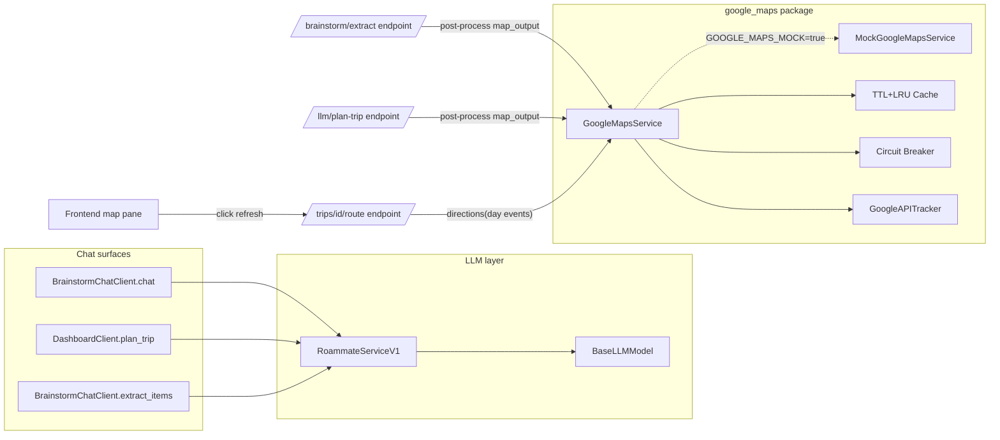

# Google Maps Service Enhancement

## Goals

- One canonical `GoogleMapsService` (no parallel `place_enricher`).
- `GOOGLE_MAPS_MOCK` env flag: a single switch flips both backend (no real Places calls) and frontend (no JS SDK load), useful for dev / CI / demos.
- Robust against rate limits, transient failures, and cold caches.
- Both AI flows that produce items for the bin (`brainstorm_extract`, `plan_trip`) get enriched the same way, inline.
- LLM output for those two flows: `{ user_output: <string>, [trip_name, duration_days,] map_output: [<items>] }`. **Option B**: `map_output` is a flat list of items so post-processing is a one-liner: `for item in resp.map_output: enrich(item)`.
- First-class observability for Google API spend, latency, errors, and cache effectiveness.
- Day-scoped route map: a refresh button at the top-center of the map pane (Plan + Live) that calls Directions for the currently-selected day's items in their existing Timeline order, on click only.

Out of scope (future): any change to `ConciergeChatClient`; real-time Google validation during chat turns; LLM tool/function calling; route waypoint optimization (we traverse in current `sort_order`).

## Target Architecture



---

# Part A — Backend Google Maps Service

## Phase 1 — Settings, Consolidate, Mock factory

### 1.1 Settings + env

- `[backend/app/core/config.py](backend/app/core/config.py)` — keep `GOOGLE_MAPS_API_KEY` (line 24), add:

```python
GOOGLE_MAPS_MOCK: bool = False
```

- `[.env.example](.env.example)` — append:

```
# Google Maps
# When GOOGLE_MAPS_MOCK=true, the backend never calls Google and the frontend
# skips the JS SDK; both render mock data. GOOGLE_MAPS_API_KEY is only used
# when GOOGLE_MAPS_MOCK=false.
GOOGLE_MAPS_MOCK=true
GOOGLE_MAPS_API_KEY=your_google_maps_key_here
NEXT_PUBLIC_GOOGLE_MAPS_MOCK=true
NEXT_PUBLIC_GOOGLE_MAPS_API_KEY=your_google_maps_key_here
```

- Semantics: `GOOGLE_MAPS_MOCK=true` ALWAYS wins. Key is irrelevant in that case. When `false`, the key must be set; if it's missing we log loudly and fall back to mock (defensive — never silently no-op).

### 1.2 Promote `place_enricher` into a `GoogleMapsService` package

Replace the single-file `[backend/app/services/google_maps.py](backend/app/services/google_maps.py)` with a package:

- `backend/app/services/google_maps/__init__.py` — exports `get_google_maps_service`, `GoogleMapsService`, `MockGoogleMapsService`.
- `backend/app/services/google_maps/service.py` — the real class.
- `backend/app/services/google_maps/mock.py` — the mock class.
- `backend/app/services/google_maps/cache.py` — Phase 2.
- `backend/app/services/google_maps/breaker.py` — Phase 2.
- `backend/app/services/google_maps/tracker.py` — Phase 5.

`GoogleMapsService` public surface:

- `async find_place(query: str) -> dict | None`
- `async place_details(place_id: str) -> dict | None`
- `async enrich_item(item: dict) -> dict` (idempotent on `place_id`)
- `async enrich_items(items: list[dict]) -> list[dict]` (parallel; Phase 2)
- `photo_url(photo_reference: str, max_width: int = 800) -> str`
- `async directions(waypoints: list[RoutePoint]) -> RouteResult` (Phase 6)

`RoutePoint` = `{ place_id: str | None, lat: float | None, lng: float | None, title: str }`. `RouteResult` = `{ encoded_polyline: str, legs: list[Leg], total_duration_s: int, total_distance_m: int }` where `Leg = { from_idx, to_idx, duration_s, distance_m, polyline: str }`.

Module-level constants and helpers from `[backend/app/services/llm/place_enricher.py](backend/app/services/llm/place_enricher.py)` (`_FIND_PLACE_URL`, `_PLACE_DETAILS_URL`, `_FIND_FIELDS`, `_DETAIL_FIELDS`, `_apply_details`) move into `service.py`.

### 1.3 `MockGoogleMapsService`

Used when `settings.GOOGLE_MAPS_MOCK=true` (or as a defensive fallback when key is missing in non-mock mode).

- Returns deterministic results derived from the query (`mock_id_<slug>`) but with the **richer detail shape** (rating, opening_hours, photo_url, formatted_address, types) so downstream code paths are exercised identically to production.
- `directions()` returns a synthesized `RouteResult` whose `encoded_polyline` is a literal straight-line interpolation between the input waypoints (encoded with the standard polyline algorithm) — enough for the frontend to render a recognizable shape on its mock map.
- Latency: every method `await asyncio.sleep(0.05)` to simulate network so loading states are visible in dev.

### 1.4 Factory

`get_google_maps_service()` in `__init__.py`:

```python
def get_google_maps_service() -> GoogleMapsService:
    if settings.GOOGLE_MAPS_MOCK:
        return MockGoogleMapsService()
    if not settings.GOOGLE_MAPS_API_KEY:
        log.error("GOOGLE_MAPS_API_KEY missing and GOOGLE_MAPS_MOCK=false; falling back to mock")
        return MockGoogleMapsService()
    return GoogleMapsService(api_key=settings.GOOGLE_MAPS_API_KEY)
```

### 1.5 Migrate callers + delete old code

- `[backend/app/services/idea_bin.py](backend/app/services/idea_bin.py)` line 6 + line 44 — switch `google_maps_service.find_place` → `get_google_maps_service().enrich_item` (gets richer field set).
- `[backend/app/api/endpoints/brainstorm.py](backend/app/api/endpoints/brainstorm.py)` lines 40, 184, 281 — replace `from app.services.llm.place_enricher import enrich_items` with `from app.services.google_maps import get_google_maps_service` and call `get_google_maps_service().enrich_items(...)`.
- Delete `[backend/app/services/google_maps.py](backend/app/services/google_maps.py)` (single file, replaced by package).
- Delete `[backend/app/services/llm/place_enricher.py](backend/app/services/llm/place_enricher.py)`.
- Update `[backend/tests/services/test_google_maps_service.py](backend/tests/services/test_google_maps_service.py)` for the new surface.

## Phase 2 — Robustness

All robustness primitives live inside the package; callers see the same `enrich_items` API.

- **In-process cache** (`cache.py`): async-safe TTL+LRU using `cachetools.TTLCache` + `asyncio.Lock`. Three namespaces:
  - `find_place` keyed on `(normalized_query, fields_signature)` — TTL 24h, maxsize 4096.
  - `place_details` keyed on `(place_id, fields_signature)` — TTL 7d, maxsize 4096.
  - `directions` keyed on `tuple(place_ids_in_order)` — TTL 1h, maxsize 1024.
  - `normalized_query` = `query.strip().casefold()`.
  - Negative caching: store `None` results with shorter TTL (1h) so we don't hammer Google for the same garbage title repeatedly.
- **Parallelism** in `enrich_items`: `asyncio.gather(*[enrich_item(i) for i in items])` bounded by `asyncio.Semaphore(5)`; one shared `httpx.AsyncClient` per batch.
- **Timeouts**: keep per-request 10s; add per-batch ceiling of `len(items) * 2s` capped at 30s using `asyncio.wait_for`.
- **Retries**: lift `_retry` pattern from `[backend/app/services/llm/models/base.py](backend/app/services/llm/models/base.py)` (lines 67–84). Retry on HTTP 429/500/503 and `httpx.TransportError`, exponential backoff base 1s, max 3 attempts.
- **Circuit breaker** (`breaker.py`): per-process state. After 5 consecutive failures inside a 60s window, open for 30s — `enrich_items` becomes a no-op, `directions` returns `None`. Half-open: one trial; success closes, failure re-opens. State transitions emit tracker events.

## Phase 3 — Coverage: enrich plan_trip inline

Currently `[backend/app/api/endpoints/brainstorm.py](backend/app/api/endpoints/brainstorm.py)` line 184 enriches extract output but `[backend/app/api/endpoints/llm.py](backend/app/api/endpoints/llm.py)` does not enrich plan_trip output before returning the preview.

- Modify `[backend/app/api/endpoints/llm.py](backend/app/api/endpoints/llm.py)` `plan_trip`:
  - After `result = await client.plan_trip(body.prompt)`, call `result["items"] = await get_google_maps_service().enrich_items(result["items"])` before constructing `PlanTripResponse`.
- Inline (not background): per the user's choice, the response blocks until enrichment completes. Cache + parallelism keep p95 acceptable; cold worst-case is ~5–10 items × ~1s with concurrency 5 ≈ 1–2s added latency.
- No DB persistence change here — `[backend/app/api/endpoints/brainstorm.py](backend/app/api/endpoints/brainstorm.py)` `bulk_insert` already accepts the enriched fields via `BrainstormItemBase`.

## Phase 4 — LLM output reshape: Option B `{user_output, ..., map_output:[...]}`

Applies only to `extract_items` and `plan_trip` (NOT to brainstorm/concierge chat).

`map_output` is the flat list of items the post-processor iterates and enriches. Trip metadata (`trip_name`, `duration_days`) stays at the top level for plan_trip — they are not iterable, not enrichable.

### 4.1 Schemas

`[backend/app/schemas/llm.py](backend/app/schemas/llm.py)`:

```python
class LLMExtractResponse(BaseModel):
    user_output: str
    map_output: list[LLMItem]

class LLMPlanResponse(BaseModel):
    user_output: str
    trip_name: str
    duration_days: int = Field(ge=1)
    map_output: list[LLMItem]
```

### 4.2 Prompts

- `[backend/app/services/llm/services/v1/prompts/brainstorm_extract_v1.txt](backend/app/services/llm/services/v1/prompts/brainstorm_extract_v1.txt)` — add a "Top-level shape" section instructing the model to return `{ "user_output": "<one-paragraph natural-language summary for the user>", "map_output": [ <items using abbreviated keys t,d,cat,tc,dur,price,tags> ] }`.
- `[backend/app/services/llm/services/v1/prompts/plan_trip_v1.txt](backend/app/services/llm/services/v1/prompts/plan_trip_v1.txt)` — instruct `{ "user_output": "...", "trip_name": "...", "duration_days": N, "map_output": [ ... ] }`.

### 4.3 Parsers

`[backend/app/services/llm/services/v1/roammate_v1.py](backend/app/services/llm/services/v1/roammate_v1.py)`:

- `extract_items` (line 198):
  ```python
  parsed = LLMExtractResponse(**data)
  return [llm_item_to_brainstorm(it) for it in parsed.map_output]
  ```
- `plan_trip` (line 230):
  ```python
  parsed = LLMPlanResponse(**data)
  return {
      "trip_name": parsed.trip_name,
      "start_date": pre.start_date.isoformat() if pre.start_date else None,
      "duration_days": parsed.duration_days,
      "items": [llm_item_to_brainstorm(it) for it in parsed.map_output],
  }
  ```

### 4.4 user_output handling

Per user decision: post-processing in both endpoints **ignores** `user_output`. It is generated and tracked (counts against output tokens) but neither persisted nor returned to the client. This keeps the door open to surface it in the UI later without another schema change. Tracker entries already capture token deltas.

Fallbacks (`BANGKOK_FALLBACK_ITEMS`, `THAILAND_PLAN_FALLBACK` in `[backend/app/services/llm/fallbacks.py](backend/app/services/llm/fallbacks.py)`) stay unchanged — consumed at the Python level, never round-trip through the schema.

## Phase 5 — Observability: GoogleAPITracker

Standalone tracker, modeled on `[backend/app/services/llm/token_tracker.py](backend/app/services/llm/token_tracker.py)`, lives in `backend/app/services/google_maps/tracker.py` and emits structured log lines on logger `roammate.google_maps`.

### 5.1 What it tracks (one event per Google call)

- `op` — `find_place` | `place_details` | `photo_url` | `directions` | `enrich_batch`
- `status` — `ok` | `zero_results` | `cache_hit` | `cache_miss` | `error` | `circuit_open` | `fallback_mock`
- `latency_ms` — wall time including retries
- `attempts` — retry count (1 = no retry)
- `cache_state` — `hit` | `miss` | `stale` | `negative_hit`
- `query_hash` — short hash of the normalized query (privacy-friendly join key, not the raw text)
- `place_id` — when present
- `http_status` — when present
- `error_class` — exception class name on failure
- `breaker_state` — `closed` | `open` | `half_open`
- Batch-only: `batch_size`, `enriched_count`, `skipped_count`
- Directions-only: `waypoint_count`, `total_distance_m`, `total_duration_s`

### 5.2 Why each field

- `latency_ms` + `op` — p50/p95 dashboards per operation; the only way to know if Google is slow vs. our retry/backoff is doing the damage.
- `status` + `cache_state` — quantify cache hit ratio and dollar savings; alert if hit ratio collapses.
- `attempts` + `http_status` + `error_class` — distinguishes Google-side problems (429s) from our problems (timeouts, parse errors), drives back-pressure tuning.
- `breaker_state` transitions — page if the breaker opens in production.
- `query_hash` — detect duplicate queries that aren't being cached due to tokenization differences without leaking PII.
- `batch_size` + `enriched_count` — measures real-world enrichment yield; falling ratio means the LLM is hallucinating place names.
- `waypoint_count` + `total_distance_m` — sanity-check Directions usage; spot pathological calls (e.g., a day with 25 waypoints).

### 5.3 How it integrates

- `service.py` imports `from .tracker import track_call` and wraps every external call: capture `t0 = time.monotonic()`, run the call, then `track_call(op=..., status=..., latency_ms=..., ...)`.
- Cache hits emit `track_call(op="find_place", status="cache_hit", latency_ms=<single-digit>)` so the cache shows up in the same stream.
- The breaker emits transition events directly.
- `enrich_items` emits one summary `enrich_batch` event in addition to per-item events.
- Same flat key=value shape as `token_tracker.track`, so existing log-aggregator queries port cleanly.

Future (out of scope): mirror to Redis counters (`google:{date}:{op}:count`, `google:{date}:cost_estimate_usd`) for daily budget caps and per-trip cost attribution.

---

# Part B — Day Map + Route Refresh

## Phase 6 — Day-scoped route refresh

User flow: on the Plan page (or Live page), the user selects a day. The map pane shows that day's items. A refresh button at the top center of the map pane, when clicked, computes a route through the day's items **ordered by `start_time` ascending** and renders a polyline. No automatic recompute on day switch, on reorder (`sort_order` changes), or on time edits — only on click.

### Ordering rules

- The route walks the day's events sorted ascending by `start_time`.
- Tie-break: if two events share an exact `start_time`, fall back to `sort_order` ascending.
- The map still renders the day's events as numbered markers (using `sort_order` for the label, matching Timeline). The polyline traces the start-time order.

### Pre-flight validation gates (HARD blocks — no Google call, no spinner)

Both the frontend and the backend enforce these gates. The frontend gates run synchronously on click so we never burn a backend request when we know it will fail; the backend re-validates defensively.

1. **Every event in the day must have a non-null `start_time`.** If any item is TBD, refresh is blocked. (Leverages the existing TBD UI in `[frontend/components/trip/Timeline.tsx](frontend/components/trip/Timeline.tsx)` lines 58–69.)
2. **No time conflicts may exist between consecutive items** in the Timeline's display order. Reuse the existing `hasConflict` helper in `[frontend/components/trip/Timeline.tsx](frontend/components/trip/Timeline.tsx)` (lines 22–25):

```ts
function hasConflict(a: Event, b: Event): boolean {
  if (!a.end_time || !b.start_time) return false;
  return a.end_time > b.start_time;
}
```

Walk the day's events in `sort_order` and check `hasConflict(prev, curr)` for every consecutive pair. The same helper already drives the red conflict ring at lines 277–278 — by checking it pre-flight, the user has already been visually warned about the same offending pair.

### Soft-skip (does NOT block refresh)

- Events without a routable location (no `place_id` AND no `lat`/`lng`) are excluded from the polyline but the rest of the route is still computed and drawn. The response surfaces them in `unroutable` with `reason: "no_location"` for the UI to flag with a small pill.

### UX — what the user sees on click

- **TBD items present** → Toast: "Add a start time to every item before generating the route." Refresh button shows a brief shake animation; no API call.
- **Conflict present** → Toast: "Resolve time conflicts in the timeline before generating the route." (The conflicting pair is already visually marked red by Timeline's existing logic.) No API call.
- **Both** → One combined toast: "Add missing start times and resolve conflicts before generating the route."
- **All clear** → Spinner on refresh button → backend call → polyline renders.

### Disabled state on the button itself

In addition to the click-time toast, the refresh button shows a passive disabled state (greyed out + tooltip) when either gate would fail, so the user understands *before* clicking why nothing will happen. Tooltip text matches the toast text. The two layers (passive disabled tooltip + click-time toast) are intentional: not every user hovers before clicking.

### 6.1 Backend: directions endpoint

New `GoogleMapsService.directions(waypoints)`:

- Calls the Routes API (`https://routes.googleapis.com/directions/v2:computeRoutes`) with `travelMode=DRIVE` (fixed), `origin = waypoints[0]`, `destination = waypoints[-1]`, and `intermediates = [...]` for the middle items.
- Prefers `place_id:` in the request when present (more accurate); falls back to `lat,lng`.
- Uses cache namespace `directions` (Phase 2.1).
- Honors retry, breaker, tracker.
- Mock variant returns a synthesized polyline (straight-line interpolation, encoded).

New endpoint in a new file `backend/app/api/endpoints/maps.py` (or appended to existing trips router — recommend new file for separation of concerns):

```
POST /trips/{trip_id}/route
Body: { "day_date": "YYYY-MM-DD" }
Auth: require_trip_member
```

Travel mode is fixed at `driving` — see Phase 7 for the rationale.

Behavior:

1. Authorize via `require_trip_member`.
2. Query events for `trip_id` filtered by `day_date == body.day_date`.
3. **Validation gate A — missing start times**: collect `event_ids` with `start_time IS NULL`. If any, return `422` with `{ detail: "missing_start_times", offending_event_ids: [...] }`. No Google call.
4. **Validation gate B — time conflicts**: walk the day's events in `sort_order` ASC and compute `prev.end_time > curr.start_time` (matching the frontend's `hasConflict`). If any pair conflicts, return `422` with `{ detail: "time_conflicts", offending_event_ids: [<ids of every event involved in any conflicting pair>] }`. No Google call.
5. Sort all events by `(start_time ASC, sort_order ASC)`. This is the route order.
6. Partition into:
   - `unroutable_no_location` — events with no `place_id` AND no `lat`/`lng`.
   - `routable` — events with a usable location.
7. If `len(routable) < 2`, return `200 { encoded_polyline: null, legs: [], unroutable: [...], ordered_event_ids: [...], reason: "need_two_points" }`.
8. Else `await get_google_maps_service().directions(waypoints, mode)`; return `200 { encoded_polyline, legs, total_duration_s, total_distance_m, ordered_event_ids, unroutable, reason: null }`.

`ordered_event_ids` reflects the start-time-sorted order so the frontend can re-label markers along the route if it wants. `unroutable` is a flat list of `{ event_id, reason: "no_location" }`.

**Why 422 instead of 400**: 422 ("Unprocessable Entity") is semantically correct — the request is well-formed but the underlying data fails business rules. The frontend distinguishes by `detail` and renders the matching toast.

Schema in `backend/app/schemas/route.py`:

```python
class RouteLeg(BaseModel):
    from_event_id: str
    to_event_id: str
    duration_s: int
    distance_m: int

class UnroutableEvent(BaseModel):
    event_id: str
    reason: Literal["no_location"]   # missing start time and conflicts are 422-blocked, not soft-skipped

class RouteResponse(BaseModel):
    encoded_polyline: str | None
    legs: list[RouteLeg]
    total_duration_s: int
    total_distance_m: int
    ordered_event_ids: list[str]   # start_time-sorted event ids that made it into the route
    unroutable: list[UnroutableEvent]
    reason: Literal["need_two_points"] | None

class RouteValidationError(BaseModel):
    detail: Literal["missing_start_times", "time_conflicts"]
    offending_event_ids: list[str]
```

### 6.2 Frontend: GoogleMap day filter

Today `[frontend/components/map/GoogleMap.tsx](frontend/components/map/GoogleMap.tsx)` reads `events` and `ideas` from the store and plots all of them.

- Add props:

```ts
interface Props {
  filterDay?: Date;       // when set, only this day's events are plotted
  routeMode?: boolean;    // when true, render polyline state
}
```

- Filter `events.filter(e => e.day_date === ymd(filterDay))` — same shape as `[frontend/components/trip/Timeline.tsx](frontend/components/trip/Timeline.tsx)` line 168.
- Hide ideas when `filterDay` is set (or render desaturated — pick desaturated for context).
- Markers: keep current `sort_order`-based labelling (`index + 1`) so labels match Timeline. The route polyline is computed by the backend in `start_time` order; if the user wants visual confirmation of route order, the frontend can optionally re-number markers along the polyline using `ordered_event_ids` from the response (small visual badge or a thin numeric tag). Decision deferred — start with `sort_order` labels.

### 6.3 Frontend: Refresh button + polyline

Add to `GoogleMap` component:

- A floating button absolutely positioned `top-4 left-1/2 -translate-x-1/2 z-20` with a `RefreshCw` icon (lucide-react), aria-label "Refresh route", disabled when `filterDay` not set or events count <2.
- Local state: `route: RouteResponse | null`, `routeLoading: boolean`, `routeError: string | null`, `polylineRef: google.maps.Polyline | null`.
- Pre-flight validation (synchronous, before any fetch):
  1. Compute `dayEvents = events.filter(e => e.day_date === ymd(filterDay))`.
  2. `missingTimes = dayEvents.filter(e => e.start_time == null)`.
  3. `conflicts = []`; for each consecutive pair `(prev, curr)` in `dayEvents.sort(by sort_order)`, if `hasConflict(prev, curr)` push both into `conflicts`.
  4. If `missingTimes.length > 0` OR `conflicts.length > 0`:
     - Compose toast text (one combined message if both, otherwise the matching specific one).
     - Trigger toast (see "Toast implementation" below).
     - Briefly shake the refresh button (`framer-motion` keyframes — already imported in Timeline).
     - Do NOT fetch.
- Click handler (only runs when pre-flight passes):
  1. Read `tripId` from URL params (or pass as prop — recommend prop for testability).
  2. Read `filterDay` and format as `YYYY-MM-DD`.
  3. POST `/trips/${tripId}/route` with `{ day_date }` and Bearer token. Travel mode is hard-coded to driving server-side.
  4. On `422` (defensive — should be rare since frontend pre-checked), parse `detail` and show the matching toast. This handles the race where the user opens two tabs and edits times in one.
  5. On success, decode `encoded_polyline` via `google.maps.geometry.encoding.decodePath` (requires `geometry` library — add to `Loader.libraries`).
  6. Replace any existing `polylineRef` (`setMap(null)` then create new) and `polylineRef = new google.maps.Polyline({ path, strokeColor: '#4f46e5', strokeWeight: 4, strokeOpacity: 0.85, map })`.
  7. `map.fitBounds` over polyline.
  8. Show an inline pill summarizing `unroutable` if any: "N items hidden from route — no location data".

### Disabled state

The refresh button is rendered with `disabled` (lower opacity, no hover effect, `cursor-not-allowed`) when:

- `dayEvents.length < 2`, OR
- any `dayEvents` has `start_time == null`, OR
- any consecutive pair in `dayEvents` has a `hasConflict`.

The button retains a `title` attribute matching the would-be toast so hovering explains why it's inert. Click handler still runs and fires the toast (so users who don't notice the disabled styling still get feedback).

### Toast implementation

The codebase has no shared toast library — `[frontend/app/dashboard/page.tsx](frontend/app/dashboard/page.tsx)` line 562 uses an inline `AnimatePresence` pop-up (`showSkipToast`). Mirror that pattern: a small `<MapToast />` component nested inside `GoogleMap` that consumes a `{ message, kind }` state and auto-hides after ~3.5s. Avoid introducing a new dependency.

- **No auto-refresh**: the route is recomputed only when the user clicks the refresh button. Specifically, none of these trigger a refetch:
  - Day switch (`filterDay` change)
  - Drag-reorder of timeline (`sort_order` change)
  - Time edits (`start_time` / `end_time` change)
  - New events added or removed from the day
  - Mode switch (Plan ↔ Live)
- However, when any of the above happen *after* a successful fetch, the polyline is **kept on screen** but a "Stale route — click refresh" badge is shown next to the refresh button so the user knows the displayed route may not reflect current data. Stale-detection compares the current day's event-id-set + `start_time` values + count against a snapshot taken at last successful fetch.
- When `filterDay` changes, also clear the polyline visually if the new day has zero successfully-fetched route data (avoids showing yesterday's route on today's map).

### 6.4 Wire into Plan + Live pages

`[frontend/app/trips/page.tsx](frontend/app/trips/page.tsx)`:

- Plan mode (line 502–504): `<GoogleMap filterDay={planDay ?? undefined} />`.
- Live mode (line 548–552): `<GoogleMap filterDay={liveDay ?? undefined} />`.

Both pages already compute `planDay` and `liveDay` (Date objects derived from the selected `tripDays[idx]`).

### 6.5 Frontend mock parity

When `process.env.NEXT_PUBLIC_GOOGLE_MAPS_MOCK === 'true'`, `GoogleMap`:

- Skips the `Loader` entirely.
- Renders a mock pane (background gradient, item cards 1..N representing the filtered day, a stylized SVG line connecting them when route state is set).
- Refresh button still calls the backend `/trips/{id}/route` endpoint — the backend's `MockGoogleMapsService` returns a synthesized polyline. Decode is replaced with a "mock polyline coords" parsing branch when `NEXT_PUBLIC_GOOGLE_MAPS_MOCK=true`. Net effect: dev sees the full UX without any Google account.

This keeps the frontend mock and backend mock in lockstep — flipping one flag flips both stacks.

---

## File-Level Change Summary

### New
- `backend/app/services/google_maps/__init__.py`
- `backend/app/services/google_maps/service.py`
- `backend/app/services/google_maps/mock.py`
- `backend/app/services/google_maps/cache.py`
- `backend/app/services/google_maps/breaker.py`
- `backend/app/services/google_maps/tracker.py`
- `backend/app/api/endpoints/maps.py` (new `POST /trips/{id}/route`)
- `backend/app/schemas/route.py`
- `backend/tests/api/test_route_endpoint.py`

### Modified
- `[backend/app/core/config.py](backend/app/core/config.py)` — add `GOOGLE_MAPS_MOCK`.
- `[.env.example](.env.example)` — document `GOOGLE_MAPS_MOCK`, `NEXT_PUBLIC_GOOGLE_MAPS_MOCK`.
- `[backend/app/services/idea_bin.py](backend/app/services/idea_bin.py)` — `get_google_maps_service`.
- `[backend/app/api/endpoints/brainstorm.py](backend/app/api/endpoints/brainstorm.py)` — lines 40, 184, 281.
- `[backend/app/api/endpoints/llm.py](backend/app/api/endpoints/llm.py)` — inline enrich plan_trip items.
- `[backend/app/schemas/llm.py](backend/app/schemas/llm.py)` — Option B response shapes.
- `[backend/app/services/llm/services/v1/roammate_v1.py](backend/app/services/llm/services/v1/roammate_v1.py)` — new parsers (lines 198, 230).
- `[backend/app/services/llm/services/v1/prompts/brainstorm_extract_v1.txt](backend/app/services/llm/services/v1/prompts/brainstorm_extract_v1.txt)`
- `[backend/app/services/llm/services/v1/prompts/plan_trip_v1.txt](backend/app/services/llm/services/v1/prompts/plan_trip_v1.txt)`
- `[backend/tests/services/test_google_maps_service.py](backend/tests/services/test_google_maps_service.py)`
- `[backend/tests/api/test_llm_plan_trip.py](backend/tests/api/test_llm_plan_trip.py)`
- `[backend/tests/cross/test_brainstorm_lifecycle.py](backend/tests/cross/test_brainstorm_lifecycle.py)`
- `[backend/requirements.txt](backend/requirements.txt)` — add `cachetools`.
- `[frontend/components/map/GoogleMap.tsx](frontend/components/map/GoogleMap.tsx)` — props, filter, refresh, polyline, mock branch.
- `[frontend/app/trips/page.tsx](frontend/app/trips/page.tsx)` — pass `filterDay` to `GoogleMap` (lines 503, 549) and `tripId`.

### Deleted
- `[backend/app/services/google_maps.py](backend/app/services/google_maps.py)` (replaced by package)
- `[backend/app/services/llm/place_enricher.py](backend/app/services/llm/place_enricher.py)`

## Risks / Notes

- LLM prompt change is the highest-risk piece; schema parse failures already fall back to `BANGKOK_FALLBACK_ITEMS` (`[backend/app/services/llm/services/v1/roammate_v1.py](backend/app/services/llm/services/v1/roammate_v1.py)` lines 224–226), so a malformed envelope won't break the user, but it will silently degrade until the prompt is fixed. Add an explicit log when fallback fires (already present at line 225).
- Inline plan_trip enrichment adds latency to a user-visible endpoint. Cache hit ratio for a freshly-deployed instance starts at 0; warm-up will be visible in dashboards before improving.
- `MockGoogleMapsService` parity matters — if it returns different fields than real, dev and prod will silently diverge. Add a parity test that asserts the mock and a recorded fixture share the same set of populated keys.
- Directions cost is per-request (no SKU per waypoint up to 10), but a 10+ waypoint day is costly; tracker's `waypoint_count` field lets us add an upper-bound check later.
- Route is **not** auto-refreshed on day switch, reorder, time edit, or add/remove. The user must click refresh. This is intentional per the user's spec; a "Stale route — click refresh" badge appears next to the refresh button when the underlying day's events change after a successful fetch (id-set + `start_time` + count snapshot diff).
- Route order is driven by `start_time`, **not** by `sort_order`. Drag-reordering does not change the route — only `start_time` edits do.
- Refresh is **strictly gated**: any TBD item or any time conflict blocks the call entirely (no Google spend, no spinner). The user must fix the timeline first. Conflict detection reuses the existing client-side `hasConflict` helper (the same one that already paints the time badge red), keeping UX and validation in lockstep — anything the UI marks red will block refresh.
- The 422 backend validation is the source of truth; the frontend pre-check is an optimization to avoid spending a request when we already know it will fail. If the two ever disagree (e.g., a multi-tab edit race), the 422 path still produces the correct toast.
- Frontend mock branch must feature-detect: skip `Loader.load()` entirely when `NEXT_PUBLIC_GOOGLE_MAPS_MOCK=true` to avoid loading the SDK with a missing key in CI.

---

# Phase 7 — Migration to Places API (New) + Routes API

The original implementation used Google's **legacy** Maps Web Service APIs (Find Place / Place Details / Directions). Google has since shipped:

- **Places API (New)** — base URL `https://places.googleapis.com/v1/...` — replaces Find Place, Place Details, and Place Photo.
- **Routes API** — base URL `https://routes.googleapis.com/directions/v2:computeRoutes` — replaces the legacy Directions API.

Migrating gets us:

- Better SKU economics (field-mask-driven billing — you pay only for the fields you ask for).
- A future-proof API surface — Google has frozen feature work on the legacy endpoints.
- Smaller blast radius on enriched-field bloat: each `X-Goog-FieldMask` header explicitly lists the fields we want, so cost is deterministic.

## 7.1 Field-set decision

Drop `formatted_phone_number`, `website`, and `opening_hours` from enrichment. Keep `rating` and `price_level`.

Rationale:

- Frontend never reads `phone`, `website`, or `opening_hours` (a `Grep` across `frontend/` returns zero matches). They were enriched but unused — pure billing waste.
- DB columns for these fields stay (`brainstorm_bin_items`, `idea_bin_items`, `events` in `[backend/app/models/all_models.py](backend/app/models/all_models.py)`). We just stop populating them on new writes. Existing rows are unaffected; nullable columns with no UI consumer = zero risk.
- `rating` and `price_level` are still rendered in `BrainstormBin` / `IdeaBin` cards and feed the brainstorm summary tooltip.

## 7.2 Endpoint mapping

| Operation | Legacy endpoint | New endpoint |
|-----------|-----------------|--------------|
| Find a place by free-text title | `GET maps.googleapis.com/maps/api/place/findplacefromtext/json` | `POST places.googleapis.com/v1/places:searchText` |
| Place details by `place_id` | `GET maps.googleapis.com/maps/api/place/details/json` | `GET places.googleapis.com/v1/places/{place_id}` |
| Place photo URL | `GET maps.googleapis.com/maps/api/place/photo` | `GET places.googleapis.com/v1/{photo.name}/media` |
| Directions / route | `GET maps.googleapis.com/maps/api/directions/json` | `POST routes.googleapis.com/directions/v2:computeRoutes` |

All four moves apply to `[backend/app/services/google_maps/service.py](backend/app/services/google_maps/service.py)`. The mock (`mock.py`) returns the same Pydantic-shaped dicts so callers don't change.

## 7.3 Auth + field masks

The new APIs do **not** accept `key=` query strings. They use headers:

- `X-Goog-Api-Key: <key>` — auth
- `X-Goog-FieldMask: <comma-separated dotted paths>` — explicitly enumerates the response fields, both for cost control and to satisfy Google's required-mask validation.
- `Content-Type: application/json` — for the POST endpoints.

Field masks per call:

```
searchText         places.id,places.displayName,places.formattedAddress,places.location,places.types
place details      id,displayName,formattedAddress,location,rating,priceLevel,types,photos
computeRoutes      routes.duration,routes.distanceMeters,routes.polyline.encodedPolyline,routes.legs.duration,routes.legs.distanceMeters
```

Notably absent (versus what the legacy implementation requested): `places.openingHours`, `places.internationalPhoneNumber`, `places.websiteUri`. Removing them downgrades the request from the **Place Details (Enterprise)** SKU bucket to the cheaper **Place Details (Pro)** bucket.

## 7.4 Response shape changes

The new API uses different field names. The `_apply_details` helper in `service.py` is rewritten to translate the new shape onto our existing `BrainstormBinItem` dict shape:

| New API field | Legacy field | Mapped to item key |
|---------------|--------------|--------------------|
| `id` | `place_id` | `place_id` |
| `displayName.text` | `name` | (not stored — title comes from LLM) |
| `formattedAddress` | `formatted_address` | `address` |
| `location.latitude` / `location.longitude` | `geometry.location.lat/lng` | `lat`, `lng` |
| `rating` | `rating` | `rating` |
| `priceLevel` (enum string) | `price_level` (int 0-4) | `price_level` (int 0-4 — see mapping below) |
| `types` | `types` | `types[:5]` |
| `photos[0].name` | `photos[0].photo_reference` | drives `photo_url` via `/media` endpoint |

The new `priceLevel` is an enum string: `PRICE_LEVEL_FREE`, `PRICE_LEVEL_INEXPENSIVE`, `PRICE_LEVEL_MODERATE`, `PRICE_LEVEL_EXPENSIVE`, `PRICE_LEVEL_VERY_EXPENSIVE`, or `PRICE_LEVEL_UNSPECIFIED`. The DB column is `Integer`, the frontend renders `'$' * price_level`, and the LLM prompt produces 0..4. Keep the integer contract by translating in `_PRICE_LEVEL_ENUM_TO_INT`:

```python
_PRICE_LEVEL_ENUM_TO_INT = {
    "PRICE_LEVEL_FREE": 0,
    "PRICE_LEVEL_INEXPENSIVE": 1,
    "PRICE_LEVEL_MODERATE": 2,
    "PRICE_LEVEL_EXPENSIVE": 3,
    "PRICE_LEVEL_VERY_EXPENSIVE": 4,
}
# PRICE_LEVEL_UNSPECIFIED -> None
```

## 7.5 Routes API request shape

Request body:

```json
{
  "origin":      { "placeId": "ChIJ..." },
  "destination": { "placeId": "ChIJ..." },
  "intermediates": [
    { "placeId": "ChIJ..." }
  ],
  "travelMode": "WALK",
  "polylineEncoding": "ENCODED_POLYLINE"
}
```

Travel mode is hard-coded to `DRIVE`:

- The previous multi-mode selector (`walking` / `driving` / `transit` / `bicycling`) was dropped per product decision — every itinerary maps to a driving estimate, the UI never exposed a picker, and the multi-SKU footprint is wider than necessary.
- The public `directions(waypoints)` method no longer accepts a `mode` parameter; the route endpoint's `RouteRequest` body schema drops the field too. The frontend stops sending it.
- The Routes API request body always sends `"travelMode": "DRIVE"`.

Waypoint encoding:

- Prefer `{"placeId": ...}` when a `place_id` is known (more accurate).
- Fall back to `{"location": {"latLng": {"latitude": ..., "longitude": ...}}}`.

Response shape (only the fields we requested are present):

```json
{
  "routes": [{
    "distanceMeters": 12345,
    "duration": "1234s",
    "polyline": { "encodedPolyline": "..." },
    "legs": [
      { "distanceMeters": 5000, "duration": "600s" },
      ...
    ]
  }]
}
```

`duration` is a Protobuf `Duration` rendered as a string with an `s` suffix (e.g. `"1234s"`). Strip the `s`, parse as int. The existing `RouteResponse` schema (`backend/app/schemas/route.py`) is unchanged — only the parser inside `service.py` translates.

## 7.6 Photo URL on the new API

Photos in the new API are referenced by their resource `name` (e.g. `places/ChIJ.../photos/ATKogp...`) instead of a `photo_reference` token. The fetch URL becomes:

```
https://places.googleapis.com/v1/{photo.name}/media?maxHeightPx=800&key={api_key}
```

`photo_url(photo_reference, max_width)` keeps its public signature (caller just passes whatever string lives in `photos[0]`); internally the URL-builder is rewritten to the v1 form. The mock keeps returning a `picsum.photos` placeholder so dev pages still render.

## 7.7 Cache + breaker + tracker

Caches keep their existing semantics (`find_place`, `place_details`, `directions`) — keys are opaque strings, so the storage layer doesn't care that the underlying API changed.

The `place_details` field-signature key changes (because we now omit phone/website/opening_hours) — that's intentional: existing cache entries from the legacy shape become unreachable and will be repopulated naturally on first call.

`tracker.track_call` keeps the same `op` names (`find_place`, `place_details`, `directions`, `enrich_batch`) so dashboards stay valid; downstream queries don't need to know which API version produced the event.

## 7.8 Mock parity

`MockGoogleMapsService.find_place` and `place_details` return the **legacy** shape today. After migration they return the **new** shape (`displayName.text`, `location.latitude/longitude`, `priceLevel` enum string, `photos[].name`) — consistent with the real call's pre-`_apply_details` response. This guarantees that when dev flips `GOOGLE_MAPS_MOCK=false` against a real key, the same parser runs against both code paths.

The mock continues to omit `formatted_phone_number`, `website`, and `opening_hours` from its dictionaries. Direct field references in tests are updated accordingly.

## 7.9 Files touched

### Modified

- `[backend/app/services/google_maps/service.py](backend/app/services/google_maps/service.py)` — new endpoint URLs, header-based auth, field masks, new request body for `directions`, rewritten `_apply_details`, `_parse_route_response`, `photo_url` for `/media`. Drops `opening_hours`, `phone`, `website` from `_apply_details`.
- `[backend/app/services/google_maps/mock.py](backend/app/services/google_maps/mock.py)` — new-shape response dicts; dropped fields removed.
- `[backend/tests/services/test_google_maps_service.py](backend/tests/services/test_google_maps_service.py)` — fixtures updated to v1 response shape.
- `[backend/tests/api/test_route_endpoint.py](backend/tests/api/test_route_endpoint.py)` — uses v1 directions response in mocks.

### Unchanged on purpose

- `[backend/app/models/all_models.py](backend/app/models/all_models.py)` — `opening_hours`/`phone`/`website` columns remain; just no new writes populate them. Avoids a migration with zero UX upside.
- `[backend/app/schemas/brainstorm.py](backend/app/schemas/brainstorm.py)` and `[backend/app/schemas/trip.py](backend/app/schemas/trip.py)` — fields stay so legacy data already in the DB still serializes.
- Frontend — no consumer of those fields.

## 7.10 Risks / rollback

- **Field mask typos** are a hard 400 error from Google. Tests pin the masks; an integration smoke against the real key on staging catches drift.
- **Cache cold-start**: existing legacy `place_details` cache entries are addressed under a different field signature in 7.7, so the first call after deploy hits Google. Acceptable — TTL is short.
- **Rollback**: revert `service.py` and `mock.py`. Schemas/DB are untouched, so revert is one commit.
- **Cost shift**: dropping the Contact + Atmosphere SKU bumps avg cost-per-detail down (rough-order: ~30–50% per call depending on Google's current price card). Monitor the tracker's `latency_ms` and `enrich_batch` events for a week post-deploy to confirm — and to catch any regression where we accidentally added a heavyweight field to the mask.
