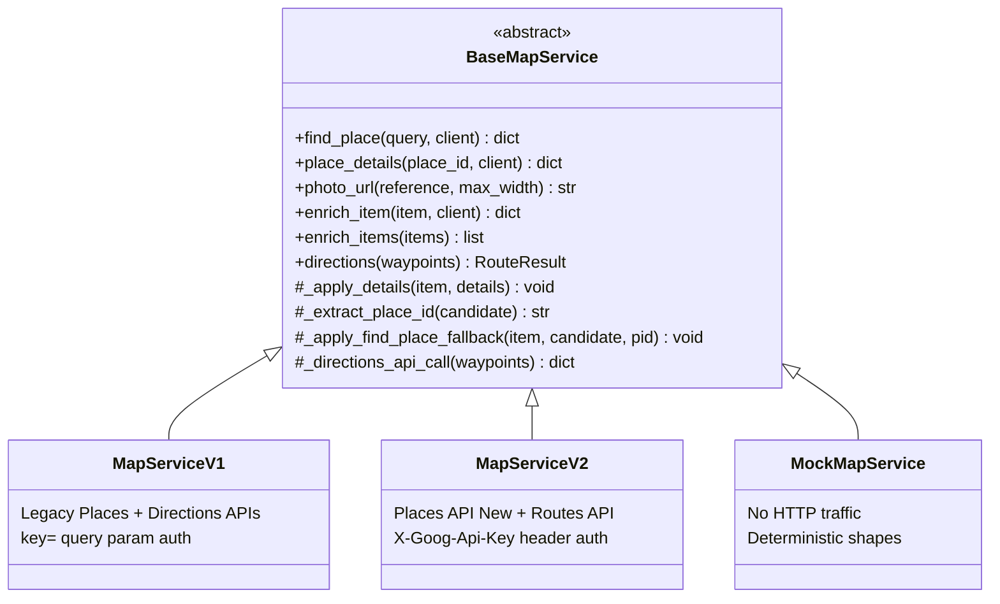
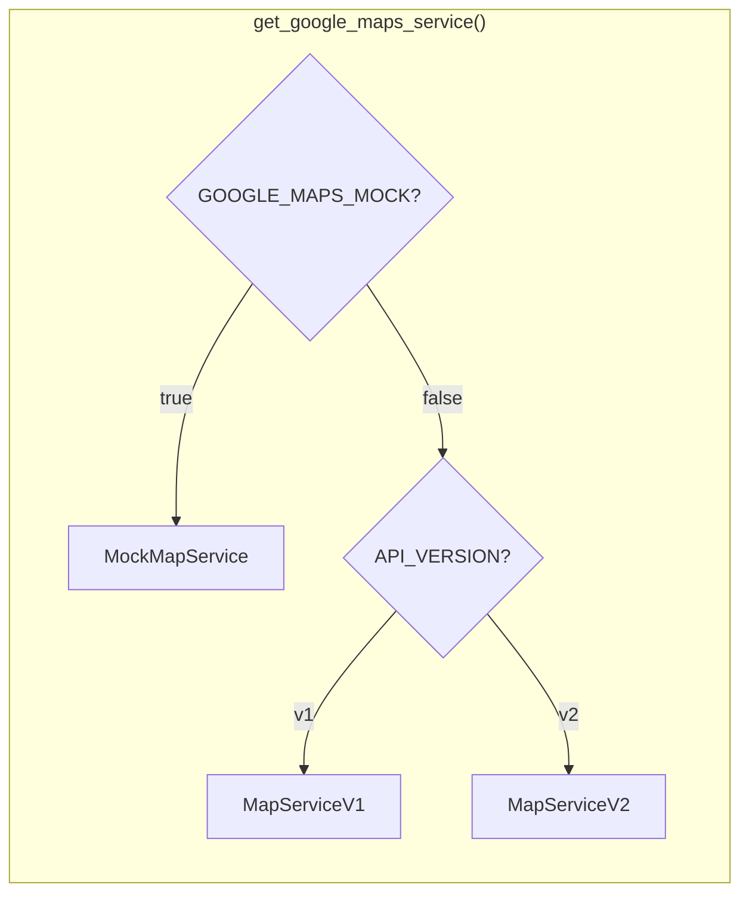

# MapService V1 / V2 Versioning Strategy

## Context

The backend Google Maps integration is versioned behind an abstract
`BaseMapService` class with two concrete implementations:

| Version | Class | Backend APIs |
|---------|-------|-------------|
| **V1** (default) | `MapServiceV1` | Legacy Places + Directions (`maps.googleapis.com`) |
| **V2** | `MapServiceV2` | Places API New + Routes API (`places.googleapis.com`, `routes.googleapis.com`) |
| **Mock** | `MockMapService` | No HTTP — deterministic in-memory data |

Selection is controlled by the `GOOGLE_MAPS_API_VERSION` environment
variable (`"v1"` or `"v2"`, default `"v1"`).  When `GOOGLE_MAPS_MOCK=true`
(dev/CI default), the mock is used regardless of version.

The frontend Maps JavaScript SDK (`Loader` in `frontend/components/map/GoogleMap.tsx`)
is **not affected** — it renders the map and markers client-side and does not
change between V1/V2. The versioning only applies to the **backend**
server-to-server enrichment and routing calls.

---

## API Usage Inventory

Our backend makes exactly **four categories** of Google API calls:

### 1. Find a place by title (enrichment step 1)
- **Where called**: `enrich_item()` in `base.py` → `find_place()` in `v1.py` / `v2.py`; also `find_place()` in `idea_bin.py`
- **Purpose**: Given a free-text place name from the LLM, find its `place_id`

### 2. Get place details (enrichment step 2)
- **Where called**: `enrich_item()` in `base.py` → `place_details()` in `v1.py` / `v2.py`
- **Purpose**: Given a `place_id`, fetch `rating`, `price_level`, `lat/lng`, `address`, `types`, `photos`

### 3. Photo URL (enrichment step 2b)
- **Where called**: `photo_url()` in `v1.py` / `v2.py`, used inside `_apply_details()`
- **Purpose**: Build a URL for the first photo of a place (rendered client-side via ``)

### 4. Compute a driving route (route refresh)
- **Where called**: `directions()` in `base.py` → `_directions_api_call()` in `v1.py` / `v2.py`, triggered by `POST /trips/{id}/route` in `maps.py`
- **Purpose**: Given ordered waypoints, compute a polyline + per-leg distance/duration

---

## V1 vs V2: API Mapping and Free Tier Comparison (India Pricing)

### Find Place

| Attribute | V1 (Legacy) | V2 (New) |
|-----------|-------------|----------|
| Endpoint | `GET maps.googleapis.com/maps/api/place/findplacefromtext/json` | `POST places.googleapis.com/v1/places:searchText` |
| SKU | **Find Place (India)** — Pro tier | **Places API Text Search Pro (India)** — Pro tier |
| Free cap | **35,000 / month** | **35,000 / month** |
| After free | **$5.10 / 1K** | **$9.60 / 1K** |
| Auth | `key=` query param | `X-Goog-Api-Key` + `X-Goog-FieldMask` headers |
| Response shape | `candidates[0]` → `place_id`, `name`, `geometry`, `formatted_address` via `fields` param | `places[0]` → `id`, `displayName`, `location`, `formattedAddress` via field mask header |

**Winner: V1** — same free cap, but nearly **half the cost** after free tier ($5.10 vs $9.60 per 1K). The legacy `Find Place` is a dedicated lightweight SKU; the new API only has `Text Search` which is a heavier (and pricier) SKU even when used for single-result lookups.

### Place Details

| Attribute | V1 (Legacy) | V2 (New) |
|-----------|-------------|----------|
| Endpoint | `GET maps.googleapis.com/maps/api/place/details/json` | `GET places.googleapis.com/v1/places/{id}` |
| SKU (our fields) | **Places Details (India)** — Pro tier (we request `rating`, `price_level`, `photos`, `types`, `formatted_address`, `geometry`) | **Places API Place Details Pro (India)** — Pro tier (we request `rating`, `priceLevel`, `photos`, `types`, `formattedAddress`, `location`) |
| Free cap | **35,000 / month** | **35,000 / month** |
| After free | **$5.10 / 1K** | **$5.10 / 1K** |
| Notes | Legacy splits billing across Basic (free) + Contact + Atmosphere sub-SKUs; since we dropped Contact and Atmosphere fields, we only pay the base Pro SKU. | New API bills a single SKU based on the field mask tier. Our mask lands in Pro (because of `rating` and `priceLevel`). |

**Tie** — same free cap, same price. Both are $5.10/1K after free. The new API is slightly cleaner (single SKU instead of stacked sub-SKUs) but cost-equivalent for our field set.

### Place Photos

| Attribute | V1 (Legacy) | V2 (New) |
|-----------|-------------|----------|
| Endpoint | `GET maps.googleapis.com/maps/api/place/photo` | `GET places.googleapis.com/v1/{photo.name}/media` |
| SKU | **Places Photo (India)** — Enterprise tier | **Places API Place Details Photos (India)** — Enterprise tier |
| Free cap | **7,000 / month** | **7,000 / month** |
| After free | **$2.10 / 1K** | **$2.10 / 1K** |
| Notes | URL built server-side with `photo_reference` + API key as query params; actual fetch happens client-side (``) | URL built server-side with `photo.name` resource path + API key as query params; actual fetch happens client-side |

**Tie** — identical pricing and free cap. Photo URLs are just URL-builders; the billing event fires when the browser fetches the image.

### Directions / Routes

| Attribute | V1 (Legacy) | V2 (New) |
|-----------|-------------|----------|
| Endpoint | `GET maps.googleapis.com/maps/api/directions/json` | `POST routes.googleapis.com/directions/v2:computeRoutes` |
| SKU | **Directions (India)** — Essentials tier | **Routes: Compute Routes Essentials (India)** — Essentials tier |
| Free cap | **70,000 / month** | **70,000 / month** |
| After free | **$1.50 / 1K** | **$1.50 / 1K** |
| Notes | Uses `mode=driving`, `waypoints=place_id:...` | Uses `travelMode=DRIVE`, structured JSON body, `X-Goog-FieldMask` |

**Tie** — identical pricing and free cap. The new Routes API is slightly more structured (JSON body vs query strings) but costs the same for Essentials-tier requests (no traffic/toll data requested).

### Summary Table

| Operation | V1 Free Cap | V1 Cost/1K | V2 Free Cap | V2 Cost/1K | Winner |
|-----------|-------------|------------|-------------|------------|--------|
| Find Place | 35,000 | $5.10 | 35,000 | $9.60 | **V1** |
| Place Details | 35,000 | $5.10 | 35,000 | $5.10 | Tie |
| Place Photos | 7,000 | $2.10 | 7,000 | $2.10 | Tie |
| Directions | 70,000 | $1.50 | 70,000 | $1.50 | Tie |

---

## Strategy Recommendation

**Default to V1 (Legacy)** for the following reasons:

1. **Find Place is nearly half the price on V1** ($5.10 vs $9.60 per 1K). This is our most frequently called API — every `enrich_item` call starts with a Find Place. For a batch of 10 items, that is 10 Find Place calls. Over a month with moderate usage this adds up.

2. **All other operations are cost-equivalent** — no penalty for using legacy.

3. **Free tier caps are identical** across V1 and V2 for all four operations. There is zero free-tier advantage to the new API.

4. **Legacy APIs are not deprecated for billing purposes** — Google still publishes legacy pricing and has not announced a sunset date. The deprecation notices apply to feature development (no new features on legacy), not availability.

5. **Simpler auth model** — V1 uses `key=` query parameter; V2 requires `X-Goog-Api-Key` + `X-Goog-FieldMask` headers. V1 is easier to debug with curl.

**Keep V2 available** as an option for:
- Future-proofing if Google does sunset legacy endpoints
- Access to new-API-only features (e.g. `EV charging` waypoints on Routes, `reviews` on Places New) if the product needs them later

---

## Architecture





### Package layout

```
backend/app/services/google_maps/
├── __init__.py       Factory + public re-exports
├── base.py           BaseMapService (abstract), dataclasses, encode_polyline, route_from_dict
├── v1.py             MapServiceV1 — legacy endpoints, key= auth
├── v2.py             MapServiceV2 — new endpoints, header auth
├── mock.py           MockMapService — no HTTP, deterministic data
├── cache.py          In-process TTL+LRU cache
├── breaker.py        Per-process circuit breaker
└── tracker.py        Structured observability tracker
```

---

## Configuration

| Variable | Default | Description |
|----------|---------|-------------|
| `GOOGLE_MAPS_MOCK` | `true` | Skip all Google API calls; use deterministic mock |
| `GOOGLE_MAPS_API_KEY` | — | Google Maps API key (required when mock=false) |
| `GOOGLE_MAPS_API_VERSION` | `v1` | `"v1"` = legacy APIs, `"v2"` = new APIs |

All three are set in `.env` / `.env.example`, `backend/app/core/config.py`, and passed through `docker-compose.yml`.

---

## File Changes (Implementation Record)

### New files

- **`backend/app/services/google_maps/base.py`** — abstract `BaseMapService` class containing:
  - Shared dataclasses: `RoutePoint`, `RouteLegResult`, `RouteResult`
  - Shared utilities: `encode_polyline()`, `route_from_dict()`
  - Shared plumbing: `_request_with_retry()`, `enrich_item()`, `enrich_items()` (these call the abstract methods, so the enrichment loop + cache + breaker + tracker logic lives here once)
  - Abstract methods: `find_place()`, `place_details()`, `photo_url()`, `_apply_details()`, `_extract_place_id()`, `_apply_find_place_fallback()`, `_directions_api_call()`

- **`backend/app/services/google_maps/v1.py`** — `MapServiceV1` subclass:
  - Legacy endpoints: `findplacefromtext`, `place/details`, `place/photo`, `directions/json`
  - `key=` query-param auth
  - Legacy response parsing: `candidates[0]`, `result`, `geometry.location.lat/lng`, `overview_polyline.points`, `legs[].distance.value` / `legs[].duration.value`
  - Legacy `_apply_details`: `place_id`, `geometry.location`, `formatted_address`, `rating`, `price_level` (int), `photos[0].photo_reference`, `types`
  - Explicitly omits: `opening_hours`, `formatted_phone_number`, `website` (matching the V2 field-drop decision)

### Renamed / refactored files

- **`backend/app/services/google_maps/service.py`** → **renamed to `v2.py`**; the `GoogleMapsService` class becomes `MapServiceV2(BaseMapService)`. All Places-New + Routes-API-specific code stays here. Shared plumbing moved to `base.py`.

- **`backend/app/services/google_maps/mock.py`** — `MockMapService` now extends `BaseMapService` instead of `GoogleMapsService`. Returns V2-shaped raw dicts and implements `_apply_details` to normalise them. Backwards-compatible alias `MockGoogleMapsService = MockMapService` preserved.

- **`backend/app/services/google_maps/__init__.py`** — factory updated:
  ```python
  @lru_cache(maxsize=1)
  def get_google_maps_service() -> BaseMapService:
      if settings.GOOGLE_MAPS_MOCK:
          return MockMapService()
      if not settings.GOOGLE_MAPS_API_KEY:
          log.error("GOOGLE_MAPS_API_KEY missing; falling back to mock")
          return MockMapService()
      if settings.GOOGLE_MAPS_API_VERSION == "v2":
          return MapServiceV2(api_key=settings.GOOGLE_MAPS_API_KEY)
      return MapServiceV1(api_key=settings.GOOGLE_MAPS_API_KEY)
  ```

### Modified files

- **`backend/app/core/config.py`** — added `GOOGLE_MAPS_API_VERSION: str = "v1"`
- **`.env.example`** — documented `GOOGLE_MAPS_API_VERSION`
- **`docker-compose.yml`** — pass-through `GOOGLE_MAPS_API_VERSION` to backend container
- **`backend/app/services/idea_bin.py`** — `find_place` response parsing now tolerates both V1 (`name`/`place_id`/`geometry.location.lat/lng`) and V2 (`displayName.text`/`id`/`location.latitude/longitude`) shapes

### Unchanged files (version-agnostic callers)

- `backend/app/api/endpoints/brainstorm.py` — calls `enrich_items()` on `BaseMapService`
- `backend/app/api/endpoints/llm.py` — calls `enrich_items()` on `BaseMapService`
- `backend/app/api/endpoints/maps.py` — calls `directions()` on `BaseMapService`

### Test files

- **`backend/tests/services/test_google_maps_service.py`** — split into:
  - 5 tests for `MockMapService` (shape validation, enrich, directions, backwards-compat alias)
  - 6 tests for `MapServiceV1` with legacy-shaped HTTP mocks (find place, details, apply_details, cache)
  - 6 tests for `MapServiceV2` with new-API-shaped HTTP mocks (find place, details, field mask validation, price level enum, cache)
  - 4 factory tests for `GOOGLE_MAPS_API_VERSION` switching (mock, v1 default, v2, missing-key fallback)

---

## Key Design Decisions

1. **`BaseMapService` owns the enrichment loop.** `enrich_item()` and `enrich_items()` live in the base class and call `self.find_place()` / `self.place_details()` / `self._apply_details()` polymorphically. The cache, breaker, tracker, semaphore, and batch logic are written once.

2. **Each version owns its own `_apply_details`.** V1 reads `geometry.location.lat`, `price_level` (int), `photo_reference`; V2 reads `location.latitude`, `priceLevel` (enum string), `photos[0].name`. After `_apply_details` runs, the item dict has the same normalised keys (`place_id`, `lat`, `lng`, `address`, `rating`, `price_level`, `photo_url`, `types`) regardless of version.

3. **`_request_with_retry` stays in the base class** since retry/backoff logic is identical; V1 subclass calls it with `method="GET"` + `params=`, V2 calls it with `method="POST"` + `json_body=` + `headers=`.

4. **Cache is version-aware via field-signature keys.** The `place_details` cache keys on `(place_id, fields_sig)`. V1 and V2 use different field signatures, so their cache entries are naturally isolated. No cross-contamination.

5. **MockMapService is version-neutral.** It overrides `find_place`, `place_details`, and `_apply_details` to return and normalise deterministic shapes without HTTP traffic.

6. **Default is V1.** The `GOOGLE_MAPS_API_VERSION` setting defaults to `"v1"` based on the cost analysis above. Flip to `"v2"` by setting the env var.
