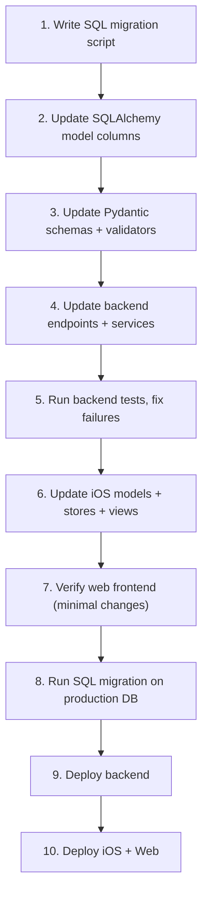

# Migrate `day_date` from Date to ISO date-string

## Problem

`day_date` is currently `Date` (a date-only type) in the DB (`timeline_item.day_date`, `day_route.day_date`) and `date` in the Pydantic schemas. This causes:
- iOS's `JSONDecoder` parses `"2026-06-01"` into a `Date` object, but timezone-dependent comparisons can shift it to the wrong day.
- The web frontend already treats `day_date` as a plain `string | null` (`"YYYY-MM-DD"`), so it works, but the backend serializes `date` objects which may not round-trip cleanly.
- Filtering (`EventModel.day_date == someDate`) requires exact type matching that differs between SQLite (tests) and PostgreSQL (prod).

## Recommended Type: `String` ("YYYY-MM-DD")

Store as a plain `VARCHAR` / `String` column in the DB, a `str` in Pydantic, a `String` in Swift, and a `string` in TypeScript.

**Why this is best across all layers:**
- **DB**: No timezone ambiguity. Simple string comparisons and indexing. PostgreSQL `VARCHAR` with `LIKE 'YYYY-%'` or equality works perfectly. SQLite test compat is trivial.
- **Backend**: Python `str` eliminates `date.fromisoformat()` / `.isoformat()` conversion boilerplate. Pydantic validates format via a regex or custom validator.
- **iOS**: Decoded as a plain `String?` -- no `DateFormatter` edge cases, no timezone shift. Display formatting happens at the view layer.
- **Web**: Already `string | null` -- zero change needed in the TypeScript interface.

---

## Layer-by-Layer Changes

### 1. Database Schema Migration

The project uses [auto_migrate.py](backend/app/db/auto_migrate.py) which does **not** handle column type changes. We need a one-time migration script.

**Schema change** in [backend/app/models/all_models.py](backend/app/models/all_models.py):
- `TimelineItem.day_date`: `Column(Date, ...)` --> `Column(String, nullable=True, index=True)`
- `DayRoute.day_date`: `Column(Date, ...)` --> `Column(String, nullable=False)`
- `DayRoute.__table_args__` UniqueConstraint on `(trip_id, day_date)` remains unchanged (works with String)

**Data migration script** (run once against production DB):
```sql
-- Step 1: Convert existing date values to ISO string
ALTER TABLE timeline_item
  ALTER COLUMN day_date TYPE VARCHAR USING day_date::text;

ALTER TABLE day_route
  ALTER COLUMN day_date TYPE VARCHAR USING day_date::text;
```
PostgreSQL's `::text` cast on a `DATE` column produces `"YYYY-MM-DD"` format natively. Indexes will be rebuilt automatically by the ALTER.

### 2. Backend Pydantic Schemas

**[backend/app/schemas/event.py](backend/app/schemas/event.py):**
- `EventBase.day_date`: `Optional[date]` --> `Optional[str]` (add a `field_validator` to ensure `YYYY-MM-DD` format)
- `EventUpdate.day_date`: `Optional[date]` --> `Optional[str]`
- Remove `from datetime import date` if no longer needed

**[backend/app/schemas/concierge.py](backend/app/schemas/concierge.py):**
- `MoveEventParams.new_day_date` -- already `Optional[str]`, no change
- `AddEventParams.day_date` -- already `Optional[str]`, no change

**[backend/app/schemas/dashboard.py](backend/app/schemas/dashboard.py):**
- `TodayWidgetPage.today_date` -- this is the *widget's* today, not `day_date`. Keep as `date` or change to `str`. Separate concern.

**[backend/app/api/endpoints/maps.py](backend/app/api/endpoints/maps.py):**
- `RouteRequest.day_date`: `date` --> `str`
- `get_stored_route` query param: `day_date: date = Query(...)` --> `day_date: str = Query(...)`

### 3. Backend Endpoint Logic -- Exhaustive Comparison Audit

Every site where `day_date` is compared, serialized, or assigned from a computed date value.

#### WILL BREAK: SQLAlchemy `.where()` comparing `date` object against `str` column (7 sites)

1. **`concierge.py:98`** -- `EventModel.day_date == today` where `today = today_in_tz(trip_tz)` returns `date`. Fix: `== today.isoformat()`
2. **`dashboard.py:123`** -- `TimelineItem.day_date == trip_today` where `trip_today = today_in_tz(trip_tz)`. Fix: `== trip_today.isoformat()`
3. **`trips.py:298`** -- `EventModel.day_date == old_day_date` where `old_day_date = d.date` (`TripDay.date` is `Date`). Fix: `== old_day_date.isoformat()`
4. **`trips.py:302`** -- `evt.day_date = new_day_date` where `new_day_date` is a `date`. Fix: `= new_day_date.isoformat()`
5. **`trips.py:907`** -- `EventModel.day_date == deleted_date` where `deleted_date = day.date`. Fix: `== deleted_date.isoformat()`
6. **`trips.py:952`** -- `EventModel.day_date == old_date` where `old_date = d.date`. Fix: `== old_date.isoformat()`
7. **`trips.py:956`** -- `evt.day_date = new_date` where `new_date = old_date - timedelta(days=1)`. Fix: `= new_date.isoformat()`

#### WILL BREAK: `.isoformat()` called on what becomes a `str` (raises AttributeError, 2 sites)

8. **`concierge.py:72`** -- `e.day_date.isoformat()`. Fix: just `e.day_date`
9. **`concierge_executor.py:67`** -- `e.day_date.isoformat()`. Fix: just `e.day_date`

#### WILL BREAK: `date` object assigned/constructed for `day_date` (5 sites in concierge_executor)

10. **`concierge_executor.py:223`** -- `event.day_date = date.fromisoformat(new_day)`. Fix: `= new_day`
11. **`concierge_executor.py:257`** -- `day_date_val = date.fromisoformat(params["day_date"])`. Fix: `= params["day_date"]`
12. **`concierge_executor.py:260`** -- `day_date_val = from_utc(start_time, trip_tz).date()`. Fix: append `.isoformat()`
13. **`concierge_executor.py:262`** -- `day_date_val = today_in_tz(trip_tz)`. Fix: append `.isoformat()`
14. **`concierge_executor.py:313`** -- `day_date_val = from_utc(start_time, trip_tz).date()`. Fix: append `.isoformat()`

#### SAFE: string-to-string comparisons (no change needed, 5 sites)

- **`maps.py:108`** -- `EventModel.day_date == body.day_date` (both `str` after schema change)
- **`maps.py:226, 242`** -- `DayRoute.day_date == body.day_date` (both `str`)
- **`maps.py:281, 291`** -- `DayRoute.day_date == day_date` (query param becomes `str`)
- **`events.py:62`** -- `day_date=event_in.day_date` (pass-through `str`)
- **`events.py:144-145`** -- `update.day_date != event.day_date` and assignment (both `str`)

### 4. iOS Frontend

**[ios/Roammate/Models/Event.swift](ios/Roammate/Models/Event.swift):**
- `Event.dayDate`: `Date?` --> `String?`
- `EventCreate.dayDate`: `Date?` --> `String?`
- Remove the custom `dayDateFormatter` and the custom `encode(to:)` method's special handling for `dayDate` (line 129-131)
- `EventUpdate.dayDate`: `Date?` --> `String?`

**[ios/Roammate/Network/EventService.swift](ios/Roammate/Network/EventService.swift):**
- `getEvents(tripId:dayDate:)`: parameter type `Date?` --> `String?`, remove the `isoDate()` conversion.

**[ios/Roammate/Store/TripDetailStore.swift](ios/Roammate/Store/TripDetailStore.swift):**
- Line 51: `dayDate: nil` --> pass `nil` (still nil, type changes to `String?`)
- Line 61: `grouping: events, by: { Self.normalizedDay($0.dayDate ?? .distantPast) }` -- this groups by `Date`; needs rewrite to group by the string directly, e.g. `by: { $0.dayDate ?? "" }`, and change `eventsByDay` key type from `Date` to `String`.
- Line 75: `loadDay(_ date: Date)` --> convert `Date` to `"YYYY-MM-DD"` string before passing to `EventService.getEvents`.

**[ios/Roammate/Views/Trips/Plan/AddToTimelineSheet.swift](ios/Roammate/Views/Trips/Plan/AddToTimelineSheet.swift):**
- Line 139: `dayDate: day.date` -- need to ensure `day.date` is formatted as `"YYYY-MM-DD"` string.

**[ios/Roammate/Views/Trips/Plan/TimelineDrawerContent.swift](ios/Roammate/Views/Trips/Plan/TimelineDrawerContent.swift):**
- Line 198: passing `event.dayDate` -- works if type changed.

**[ios/Roammate/Views/Dashboard/TodayWidgetCards.swift](ios/Roammate/Views/Dashboard/TodayWidgetCards.swift):**
- Lines 163-168: `utcCal.isDate(dayDate, inSameDayAs: todayUTC)` -- WILL BREAK. Compares two `Date` objects but `dayDate` becomes `String?`. Fix: compute today as `"YYYY-MM-DD"` string and compare `event.dayDate == todayString`.

### 5. Web Frontend

**[frontend/lib/store.ts](frontend/lib/store.ts):**
- `Event.day_date: string | null` -- already a string. **No change needed.**
- `mapApiEvent` line 170: `day_date: (raw.day_date as string) ?? null` -- already correct.

**[frontend/components/trip/Timeline.tsx](frontend/components/trip/Timeline.tsx):**
- Line 179 / 307: uses `event.day_date` as a string. **No change needed.**

**[frontend/components/map/GoogleMap.tsx](frontend/components/map/GoogleMap.tsx):**
- Line 231, 279, 730: uses `day_date` as string. **No change needed.**

**[frontend/app/trips/page.tsx](frontend/app/trips/page.tsx):**
- Line 283: compares `e.day_date === dayToDelete.date`. **No change needed.**

### 6. Backend Tests (13 test files)

All test files that send `"day_date": "2026-06-01"` as a string in JSON payloads will continue to work since the API now accepts `str` instead of `date` (Pydantic coerced the string to `date` before; now it stays `str`).

However, test assertions that compare against `date` objects or check response format need review:
- [backend/tests/api/test_trip_days.py](backend/tests/api/test_trip_days.py): line 244 asserts `events[0]["day_date"] == "2026-06-02"` -- already string comparison, **works as-is**.
- All 13 test files in `backend/tests/` -- scan for `.day_date` attribute access on ORM objects that previously returned `date` and now return `str`.

### 7. Frontend Tests

- [frontend/tests/store.test.ts](frontend/tests/store.test.ts): `day_date: null` -- **no change**.
- [frontend/tests/Timeline.test.tsx](frontend/tests/Timeline.test.tsx): `day_date: '2026-05-01'` / `null` -- **no change**.

---

## Migration Execution Order



## Validation Approach

Add a Pydantic `field_validator` on `day_date` fields to enforce format:

```python
import re
_DATE_RE = re.compile(r"^\d{4}-\d{2}-\d{2}$")

@field_validator("day_date", mode="after")
@classmethod
def _validate_day_date(cls, v: str | None) -> str | None:
    if v is not None and not _DATE_RE.match(v):
        raise ValueError("day_date must be YYYY-MM-DD")
    return v
```

## Risk Assessment

- **Low risk on web frontend**: already treats `day_date` as `string`.
- **Medium risk on iOS**: 2 sites do `Date`-based comparisons on `dayDate` (`TodayWidgetCards` and `TripDetailStore.normalizedDay()`).
- **Medium risk on backend**: 14 sites total will break -- 7 SQLAlchemy `.where()` comparisons, 2 `.isoformat()` calls, 5 `date` object assignments.
- **Low risk on DB migration**: PostgreSQL `DATE::text` is deterministic and always produces `YYYY-MM-DD`.
